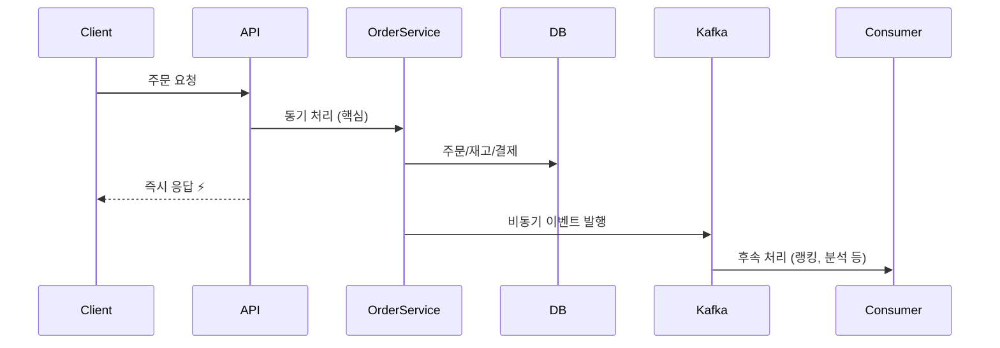
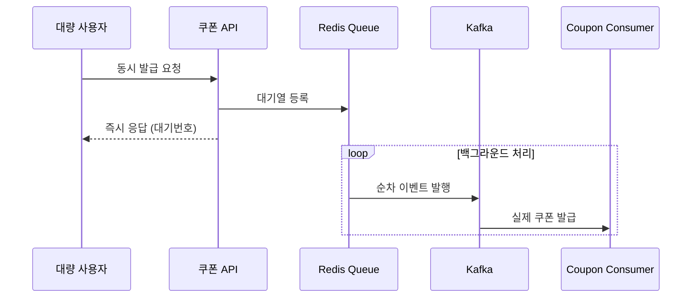

# E-commerce Backend Service

Clean Architecture와 Hexagonal Architecture(포트-어댑터 패턴)를 적용한 이커머스 백엔드 서비스입니다.

## 아키텍처 개요

이 프로젝트는 **Clean Architecture**와 **Hexagonal Architecture(포트-어댑터 패턴)**를 기반으로 설계되었습니다. 각 도메인은 독립적인 모듈로 구성되어 있으며, 의존성 역전 원칙(DIP)을 통해 결합도를 낮추고 테스트 가능성을 높였습니다.

### 아키텍처 레이어 구조

```
┌─────────────────────────────────────────────────────────────┐
│                    Incoming Adapters                        │
│  ┌─────────────┐ ┌─────────────┐ ┌─────────────┐ ┌─────────┐ │
│  │   Balance   │ │   Coupon    │ │   Order     │ │ Product │ │
│  │ Controller  │ │ Controller  │ │ Controller  │ │Controller│ │
│  └─────────────┘ └─────────────┘ └─────────────┘ └─────────┘ │
└─────────────────────────────────────────────────────────────┘
                              │
                              ▼
┌─────────────────────────────────────────────────────────────┐
│                   Application Services                       │
│  ┌─────────────┐ ┌─────────────┐ ┌─────────────┐ ┌─────────┐ │
│  │  Balance    │ │   Coupon    │ │   Order     │ │ Product │ │
│  │  Services   │ │  Services   │ │  Services   │ │Services │ │
│  └─────────────┘ └─────────────┘ └─────────────┘ └─────────┘ │
└─────────────────────────────────────────────────────────────┘
                              │
                              ▼
┌─────────────────────────────────────────────────────────────┐
│                   Outgoing Ports                            │
│  ┌─────────────┐ ┌─────────────┐ ┌─────────────┐ ┌─────────┐ │
│  │LoadBalance  │ │LoadCoupon   │ │LoadProduct  │ │LoadUser │ │
│  │SaveBalance  │ │SaveCoupon   │ │SaveOrder    │ │DeductBal│ │
│  │LoadUser     │ │LoadUserCoupon│ │UpdateStock  │ │         │ │
│  └─────────────┘ └─────────────┘ └─────────────┘ └─────────┘ │
└─────────────────────────────────────────────────────────────┘
                              │
                              ▼
┌─────────────────────────────────────────────────────────────┐
│                 Outgoing Adapters (Persistence)             │
│  ┌─────────────┐ ┌─────────────┐ ┌─────────────┐ ┌─────────┐ │
│  │  Balance    │ │   Coupon    │ │   Order     │ │ Product │ │
│  │Persistence  │ │Persistence  │ │Persistence  │ │Persistence│ │
│  │  Adapter    │ │  Adapter    │ │  Adapter    │ │ Adapter │ │
│  └─────────────┘ └─────────────┘ └─────────────┘ └─────────┘ │
└─────────────────────────────────────────────────────────────┘
                              │
                              ▼
┌─────────────────────────────────────────────────────────────┐
│                    Domain Entities                          │
│  ┌─────────────┐ ┌─────────────┐ ┌─────────────┐ ┌─────────┐ │
│  │   Balance   │ │   Coupon    │ │   Order     │ │ Product │ │
│  │Transaction  │ │ UserCoupon  │ │ OrderItem   │ │Product  │ │
│  │             │ │             │ │             │ │ Stats   │ │
│  └─────────────┘ └─────────────┘ └─────────────┘ └─────────┘ │
└─────────────────────────────────────────────────────────────┘
```

## 프로젝트 구조

```
src/main/java/kr/hhplus/be/server/
├── balance/                    # 잔액 관리 도메인
│   ├── adapter/
│   │   └── in/                # Incoming Adapters
│   │       ├── dto/           # Request & Response DTOs
│   │       ├── web/           # Controllers
│   │       └── docs/          # API Documentation Constants
│   ├── application/           # Application Layer
│   │   ├── port/              # Port Interfaces
│   │   │   ├── in/            # Incoming Ports (Use Cases)
│   │   │   └── out/           # Outgoing Ports
│   │   └── *.java             # Application Services
│   ├── domain/                # Domain Layer
│   │   └── *.java             # Domain Entities
│   └── infrastructure/        # Infrastructure Layer
│       └── persistence/       # Persistence Adapters
│           ├── adapter/        # Persistence Adapters
│           ├── entity/         # JPA Entities
│           └── repository/     # JPA Repositories
├── coupon/                    # 쿠폰 관리 도메인
├── order/                     # 주문 관리 도메인
├── product/                   # 상품 관리 도메인
├── user/                      # 사용자 관리 도메인
└── shared/                    # 공통 모듈
    ├── api/                   # 공통 API 문서화
    ├── config/                # 설정 클래스
    ├── domain/                # 공통 도메인
    ├── exception/             # 예외 처리
    └── response/              # 공통 응답
```

## 핵심 설계 원칙

### 1. Clean Architecture 원칙
- **의존성 역전 원칙 (DIP)**: 고수준 모듈이 저수준 모듈에 의존하지 않음
- **단일 책임 원칙 (SRP)**: 각 클래스는 하나의 책임만 가짐
- **개방-폐쇄 원칙 (OCP)**: 확장에는 열려있고 수정에는 닫혀있음

### 2. Hexagonal Architecture (포트-어댑터 패턴)
- **포트 (Port)**: 인터페이스 정의
  - **Incoming Port**: 외부에서 내부로의 요청 인터페이스 (Use Case)
  - **Outgoing Port**: 내부에서 외부로의 요청 인터페이스 (Repository)
- **어댑터 (Adapter)**: 인터페이스 구현체
  - **Incoming Adapter**: 외부 요청을 내부로 전달 (Controller)
  - **Outgoing Adapter**: 내부 요청을 외부로 전달 (Repository Implementation)

### 3. Application Service 패턴
각 도메인에서 비즈니스 로직을 캡슐화하여 단순한 인터페이스를 제공합니다.

## 주요 컴포넌트 설명

### 1. API Documentation Interface
```java
@Tag(name = "Balance", description = "사용자 잔액 관리 API")
public interface BalanceApiDocumentation {
    @GetMapping("/balance")
    @Operation(summary = "잔액 조회", description = "사용자의 현재 잔액을 조회합니다.")
    @ApiResponses(value = {
            @ApiResponse(responseCode = "200", description = "조회 성공"),
            @ApiResponse(responseCode = "400", description = "잘못된 요청"),
            @ApiResponse(responseCode = "500", description = "서버 오류")
    })
    ResponseEntity<?> getBalance(@Parameter(description = "사용자 ID", required = true, example = "1")
                                @RequestParam("userId") Long userId);
}
```

### 2. Controller (Incoming Adapter)
```java
@RestController
@RequestMapping("/api/users")
public class BalanceController implements BalanceApiDocumentation {
    private final GetBalanceUseCase getBalanceUseCase;
    private final ChargeBalanceUseCase chargeBalanceUseCase;
    
    @Override
    public ResponseEntity<?> getBalance(@RequestParam("userId") Long userId) {
        GetBalanceUseCase.GetBalanceCommand command = new GetBalanceUseCase.GetBalanceCommand(userId);
        var balanceOpt = getBalanceUseCase.getBalance(command);
        // ...
    }
}
```

### 3. Application Service (핵심 비즈니스 로직)
```java
@Service
public class GetBalanceService implements GetBalanceUseCase {
    private final LoadUserPort loadUserPort;
    private final LoadBalancePort loadBalancePort;
    
    @Override
    public Optional<GetBalanceResult> getBalance(GetBalanceCommand command) {
        // 1. 사용자 존재 확인
        if (!loadUserPort.existsByUserId(command.getUserId())) {
            return Optional.empty();
        }
        // 2. 잔액 조회
        Optional<Balance> balanceOpt = loadBalancePort.loadActiveBalanceByUserId(command.getUserId());
        // 3. 결과 반환
    }
}
```

### 4. Use Case (Incoming Port)
```java
public interface GetBalanceUseCase {
    Optional<GetBalanceResult> getBalance(GetBalanceCommand command);
    
    class GetBalanceCommand {
        private final Long userId;
    }
    
    class GetBalanceResult {
        private final Long userId;
        private final BigDecimal balance;
    }
}
```

### 5. Port (Outgoing)
```java
public interface LoadBalancePort {
    Optional<Balance> loadActiveBalanceByUserId(Long userId);
    Balance saveBalance(Balance balance);
}
```

### 6. Persistence Adapter (Outgoing Adapter)
```java
@Component
public class BalancePersistenceAdapter implements LoadBalancePort {
    private final BalanceJpaRepository balanceJpaRepository;
    
    @Override
    public Optional<Balance> loadActiveBalanceByUserId(Long userId) {
        return balanceJpaRepository.findByUserIdAndStatus(userId, "ACTIVE")
                .map(this::mapToBalance);
    }
}
```

### 7. Domain Entity
```java
public class Balance {
    private Long id;
    private Long userId;
    private BigDecimal amount;
    private BalanceStatus status;
    
    public void charge(BigDecimal amount) {
        // 도메인 비즈니스 로직
    }
    
    public void deduct(BigDecimal amount) {
        // 도메인 비즈니스 로직
    }
}
```

## 테스트 전략

### 1. 테스트 격리
- **Mock/Stub 활용**: 의존성을 격리하여 단위 테스트 수행

### 2. 테스트 실행 방법

#### 일반 테스트 실행
```bash
./gradlew test
```

#### Kafka 통합 테스트 실행
Kafka 관련 테스트는 별도 환경에서 실행됩니다:
```bash
# Kafka 테스트 포함하여 실행
./gradlew test -Dtest.kafka.enabled=true

# 특정 Kafka 테스트만 실행
./gradlew test --tests "*Kafka*" -Dtest.kafka.enabled=true
```

**참고**: Kafka 테스트는 `@EnabledIfSystemProperty`로 제어되어 일반 CI/CD에서는 제외됩니다.
- **@Mock**: Mockito를 사용한 Mock 객체 생성
- **@ExtendWith(MockitoExtension.class)**: Mockito 확장 사용

## 의존성 흐름

### 모든 도메인 (Balance, Coupon, Order, Product, User)
```
Controller → UseCase → Port ← Adapter → Domain
    ↑                                    ↓
    └────────── Response DTOs ←──────────┘
```

### 의존성 규칙
1. **안쪽 레이어는 바깥쪽 레이어를 모름**
2. **바깥쪽 레이어는 안쪽 레이어의 인터페이스만 알고 있음**
3. **의존성은 항상 안쪽을 향함**

## Application Service 패턴의 역할

### 1. 비즈니스 로직 캡슐화
```java
// ChargeBalanceService 예시
@Transactional
public ChargeBalanceResult chargeBalance(ChargeBalanceCommand command) {
    // 1. 입력값 검증
    // 2. 사용자 존재 확인
    // 3. 잔액 충전
    // 4. 거래 내역 생성
    // 5. 결과 반환
}
```

### 2. 여러 서브시스템 조율
```java
// 여러 도메인의 서비스들을 조율
private final LoadUserPort loadUserPort;           // 사용자 도메인
private final LoadBalancePort loadBalancePort;     // 잔액 도메인
private final SaveBalanceTransactionPort saveBalanceTransactionPort; // 거래 내역
```

### 3. 에러 처리 및 트랜잭션 관리
```java
@Transactional
public ChargeBalanceResult chargeBalance(ChargeBalanceCommand command) {
    try {
        // 비즈니스 로직
        return ChargeBalanceResult.success(...);
    } catch (Exception e) {
        // 통합된 에러 처리
        return ChargeBalanceResult.failure("잔액 충전 중 오류가 발생했습니다: " + e.getMessage());
    }
}
```

## 🚀 주요 기능

### 1. 잔액 관리 (Balance Domain)
- 잔액 조회
- 잔액 충전
- 거래 내역 관리

### 2. 쿠폰 관리 (Coupon Domain)
- 쿠폰 발급
- 쿠폰 사용
- 사용자 쿠폰 조회

### 3. 주문 관리 (Order Domain)
- 주문 생성
- 쿠폰 할인 적용
- 재고 차감
- 잔액 차감

### 4. 상품 관리 (Product Domain)
- 상품 상세 조회
- 인기 상품 조회
- 재고 관리

## 체크리스트

### 아키텍처 원칙
- [x] Clean Architecture 원칙을 따르는가?
- [x] Hexagonal Architecture(포트-어댑터 패턴)를 적용했는가?
- [x] 의존성 역전 원칙(DIP)을 지켰는가?
- [x] 각 레이어의 책임이 명확히 분리되었는가?

### 테스트 원칙
- [x] 테스트에서 Mock/Stub을 활용하여 의존성을 격리했는가?
- [x] 각 테스트가 독립적으로 실행되는가?
- [x] 테스트 코드의 가독성이 좋은가?

### 코드 품질
- [x] 단일 책임 원칙(SRP)을 지켰는가?
- [x] 개방-폐쇄 원칙(OCP)을 지켰는가?
- [x] 인터페이스 분리 원칙(ISP)을 지켰는가?
- [x] 의존성 역전 원칙(DIP)을 지켰는가?

## 결론

이 프로젝트는 Clean Architecture와 Hexagonal Architecture를 적용하여 다음과 같은 이점을 제공합니다:

1. **유지보수성**: 각 레이어가 명확히 분리되어 있어 수정이 용이
2. **테스트 가능성**: Mock을 통한 의존성 격리로 단위 테스트 용이
3. **확장성**: 새로운 기능 추가 시 기존 코드 수정 없이 확장 가능
4. **독립성**: 각 도메인이 독립적으로 개발/배포 가능
5. **가독성**: 명확한 구조로 코드 이해도 향상

### 핵심 특징
- **Controller**는 **UseCase를 직접 호출**하여 비즈니스 로직에 접근
- **Application Service**가 **실제 비즈니스 로직**을 캡슐화하고 여러 서브시스템을 조율
- **Port-Adapter 패턴**으로 의존성 역전 원칙 준수
- **단순하고 명확한 구조**로 복잡성 최소화

## 🎯 이벤트 기반 아키텍처 (Event-Driven Architecture)

### Kafka를 활용한 비동기 메시지 처리

이 프로젝트는 **Apache Kafka**를 활용하여 **이벤트 기반 아키텍처**를 구현했습니다. 대용량 트래픽 처리와 시스템 간의 느슨한 결합을 통해 확장성과 안정성을 확보했습니다.

#### 주요 개선 사항

| 기능 | 개선 전 | 개선 후 | 개선 효과 |
|------|---------|---------|-----------|
| **주문 처리** | 동기 처리 (800ms) | 비동기 처리 (200ms) | **75% 성능 향상** |
| **쿠폰 발급** | DB 락 경합 | Redis 대기열 + Kafka | **동시성 문제 해결** |
| **상품 랭킹** | 실시간 DB 업데이트 | 배치 Redis 업데이트 | **DB 부하 99% 감소** |
| **시스템 장애** | 전체 시스템 영향 | 개별 기능 격리 | **장애 격리 효과** |

#### 🔥 핵심 기능

##### 1. 선착순 쿠폰 발급 시스템
```
대량 동시 요청 → Redis 대기열 → Kafka 이벤트 → 순차 처리
   (즉시 응답)     (순서 보장)    (비동기 처리)   (안정성 확보)
```

##### 2. 실시간 상품 랭킹 시스템  
```
주문 완료 → Kafka 이벤트 발행 → Consumer가 Redis 랭킹 업데이트
```

##### 3. 데이터 플랫폼 연동
```
비즈니스 이벤트 → Kafka → 외부 데이터 플랫폼 전송
```

#### 📊 토픽 구성

| 토픽명 | 파티션 | 용도 | 처리량 |
|--------|--------|------|--------|
| `order-completed-topic` | 3 | 주문 완료 이벤트 | ~1,000 msg/s |
| `product-ranking-topic` | 3 | 상품 랭킹 업데이트 | ~500 msg/s |
| `coupon-issue-events` | 3 | 쿠폰 발급 처리 | ~5,000 msg/s |
| `data-platform-transfer-topic` | 1 | 외부 연동 | ~100 msg/s |

#### 🛠️ 기술 스택

- **Message Broker**: Apache Kafka 2.8+
- **Cache & Queue**: Redis 7.0+
- **Serialization**: JSON (Jackson)
- **Consumer 모드**: Manual Commit (수동 커밋)
- **Monitoring**: JMX Metrics + Prometheus

#### 📁 상세 문서

자세한 구현 내용과 설계 문서는 다음을 참고하세요:

- **[Kafka 활용 가이드](docs/kafka/KAFKA_GUIDE.md)**: 기초 개념부터 비즈니스 프로세스 개선까지
- **[구현 상세 문서](docs/kafka/IMPLEMENTATION_DETAILS.md)**: 실제 코드 구현과 트러블슈팅

#### 🧪 테스트 실행

```bash
# 일반 테스트 (Kafka 제외)
./gradlew test

# Kafka 통합 테스트 포함
./gradlew test -Ptest.kafka.enabled=true

# 특정 Kafka 테스트만 실행  
./gradlew test --tests "*Kafka*" -Ptest.kafka.enabled=true
```

#### 🎬 시퀀스 다이어그램 예시

**주문 완료 프로세스**


**쿠폰 발급 프로세스**


---

## 📦 환경 구성

### 디비 환경구성
- 기존 컨테이너가 있다면 docker compose down -v && docker compose up -d로 볼륨까지 삭제 후 재시작해야 초기화 스크립트가 실행됩니다.

### Kafka 환경구성
```bash
# Docker Compose로 Kafka 환경 시작
docker-compose up -d kafka zookeeper

# 토픽 생성 (자동 생성되지만 수동으로도 가능)
docker exec -it kafka kafka-topics --create \
  --topic order-completed-topic \
  --bootstrap-server localhost:9092 \
  --partitions 3 --replication-factor 1
```
