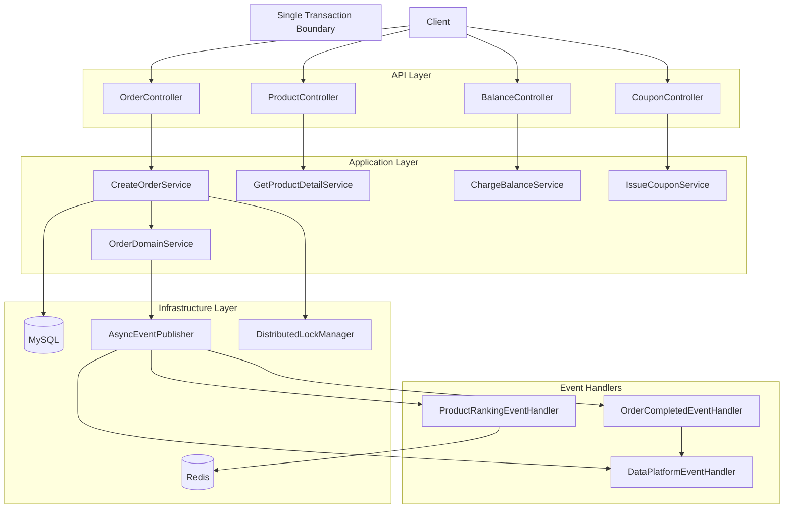
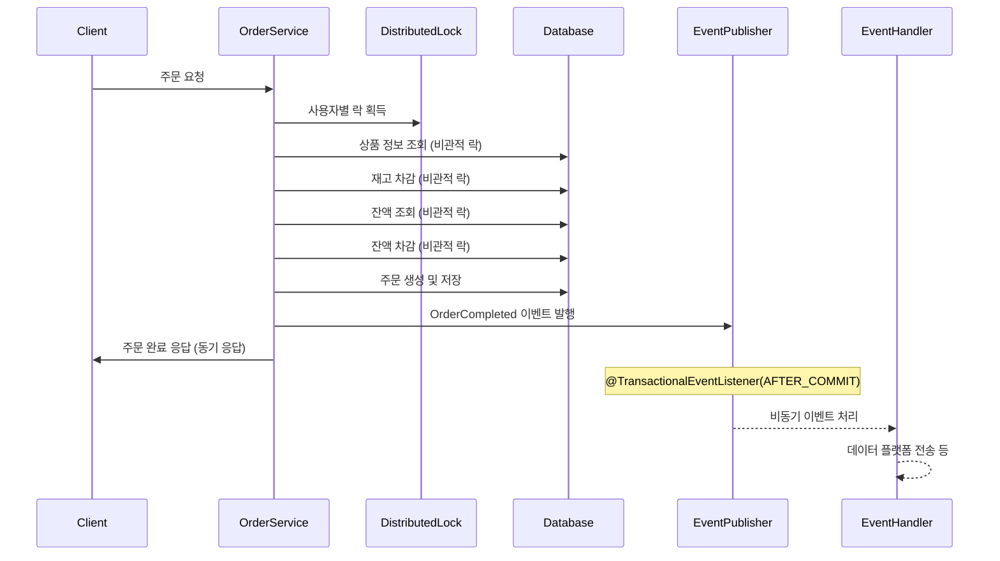
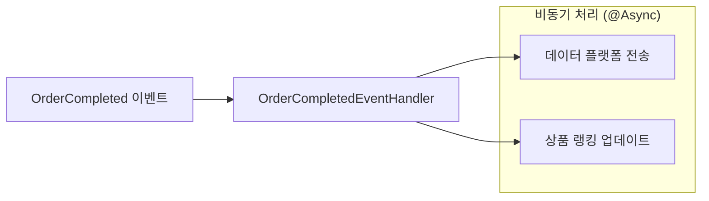
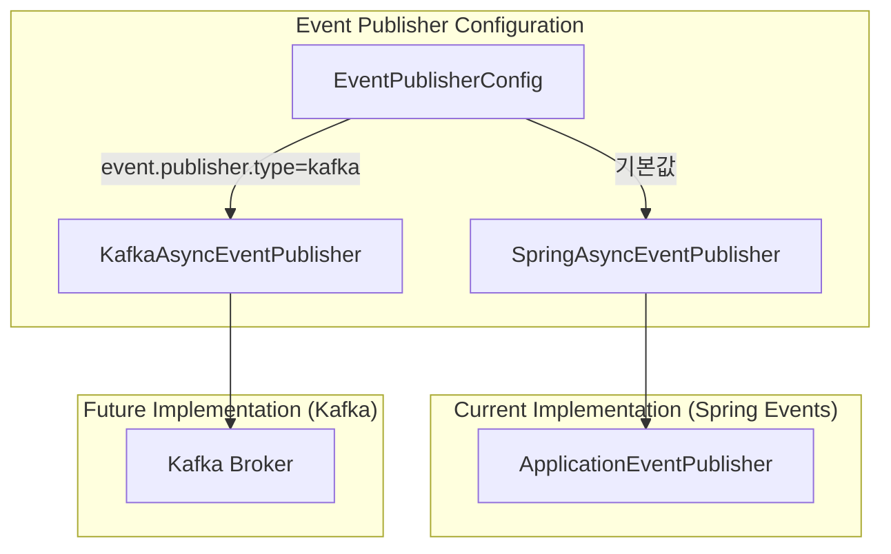
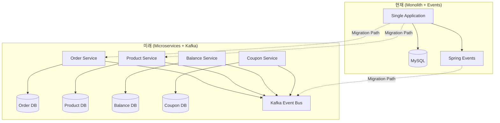
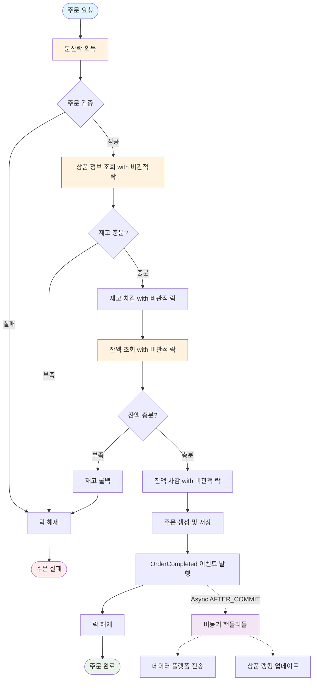
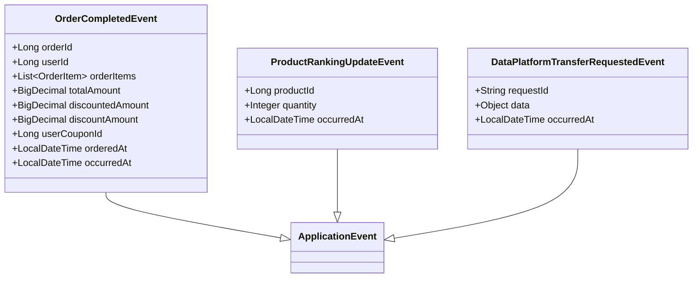
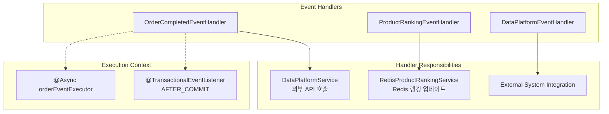

[# 동시성 제어 및 이벤트 기반 설계 문서

## 1. 개요

현재 시스템은 모놀리식 구조로 단일 데이터베이스를 사용하며, **동기식 Saga 패턴**과 **Spring Application Event**를 활용하여 동시성 제어 문제를 해결하고 있습니다. 미래 마이크로서비스 확장을 대비한 이벤트 기반 아키텍처도 고려되어 있습니다.

## 2. 현재 시스템 아키텍처

### 2.1 현재 모놀리식 구조 (헥사고날 아키텍처)


## 3. 현재 동시성 제어 해결책

### 3.1 동기식 Saga 패턴 적용 (`CreateOrderService.java:41-167`)
- **Redisson 분산 락**: 사용자별 동시성 제어 (`@DistributedLock`)
- **비관적 락**: 재고 및 잔액 차감 시 데이터베이스 수준 락
- **보상 트랜잭션**: 실패 시 재고 롤백 (`rollbackStock()`)
- **원자성 보장**: 단일 트랜잭션 내에서 모든 작업 처리

### 3.2 기술 구현 세부사항
- **분산 락**: `@DistributedLock(key = "'order_user_' + #command.userId")`
- **재고 차감**: `loadProductByIdWithLock()` + `deductStockWithPessimisticLock()`
- **잔액 차감**: `loadActiveBalanceByUserIdWithLock()` + `deductBalanceWithPessimisticLock()`
- **트랜잭션 범위**: `@Transactional`로 전체 프로세스 보장

## 4. 현재 이벤트 기반 처리

### 4.1 실제 주문 프로세스 (`CreateOrderService.java`)
현재는 **동기식 처리** 후 **비동기 이벤트 발행**으로 구현되어 있습니다.



### 4.2 현재 이벤트 처리 구조 (`OrderCompletedEventHandler.java`)


## 5. 현재 구현된 이벤트 시스템

### 5.1 이벤트 발행 구조 (`EventPublisherConfig.java`)


### 5.2 실제 이벤트 종류
**현재 구현된 이벤트들:**
- `OrderCompletedEvent`: 주문 완료 시 발행
- `ProductRankingUpdateEvent`: 상품 랭킹 업데이트 시 발행
- `DataPlatformTransferRequestedEvent`: 데이터 플랫폼 전송 시 발행

**이벤트 핸들러들:**
- `OrderCompletedEventHandler`: 데이터 플랫폼 전송 처리
- `ProductRankingEventHandler`: Redis 상품 랭킹 업데이트
- `DataPlatformEventHandler`: 외부 시스템 연동

## 6. 미래 확장을 위한 설계

### 6.1 Kafka 기반 이벤트 아키텍처 (준비 단계)
현재 `application.yml`에는 Kafka 설정이 준비되어 있지만 아직 사용하지 않습니다.

```yaml
# 현재 설정 (application.yml)
event:
  publisher:
    type: spring  # spring(기본값) 또는 kafka

# 준비된 Kafka 설정
kafka:
  bootstrap-servers: localhost:9092
  topics:
    order-completed: order-completed-topic
    product-ranking: product-ranking-topic
    data-platform-transfer: data-platform-transfer-topic
```

### 6.2 마이크로서비스 전환 시 예상 구조


## 7. 현재 주문 처리 플로우

### 7.1 실제 구현된 동기식 처리 플로우


## 8. 실제 구현된 이벤트 설계

### 8.1 현재 도메인 이벤트 정의 (`*.java` 파일들)


### 8.2 현재 이벤트 핸들러 구조


## 9. 현재 데이터 일관성 보장 방안

### 9.1 강한 일관성 (Core Business Logic)
현재 시스템은 **주문 핵심 로직**에서 강한 일관성을 보장합니다:
- **분산 락**: Redisson을 통한 사용자별 동시성 제어
- **비관적 락**: DB 레벨에서 재고/잔액 동시성 제어
- **단일 트랜잭션**: 모든 핵심 작업을 하나의 트랜잭션으로 처리
- **보상 트랜잭션**: 실패 시 `rollbackStock()` 메서드로 복구

### 9.2 최종 일관성 (Side Effects)
부가적인 작업들은 **최종 일관성**으로 처리합니다:
- **비동기 이벤트**: `@TransactionalEventListener(AFTER_COMMIT)`
- **실패 허용**: 이벤트 처리 실패가 주문에 영향 없음
- **재시도 없음**: 현재는 단순 로깅으로 처리
## 10. 현재 시스템의 장단점 분석

### 10.1 현재 구현의 장점
**동시성 제어 측면:**
- ✅ **Redisson 분산락**: 여러 인스턴스 환경에서도 동시성 제어
- ✅ **비관적 락**: DB 수준에서 확실한 동시성 제어
- ✅ **단일 트랜잭션**: 강한 일관성 보장
- ✅ **보상 트랜잭션**: 실패 시 롤백 로직

**이벤트 처리 측면:**
- ✅ **비동기 처리**: 메인 로직과 부가 기능 분리
- ✅ **확장 가능성**: Spring Event → Kafka 마이그레이션 준비
- ✅ **트랜잭션 안전성**: `AFTER_COMMIT`으로 안전한 이벤트 발행

### 10.2 개선이 필요한 부분
- ⚠️ **재시도 메커니즘 없음**: 이벤트 처리 실패 시 재시도 없음
- ⚠️ **모니터링 부족**: 이벤트 처리 성공/실패 메트릭 부족
- ⚠️ **Dead Letter Queue 없음**: 실패한 이벤트 처리 방안 부족

## 11. 마이크로서비스 전환 시 고려사항

### 11.1 기술적 전환 로드맵
1. **현재 → 이벤트 저장소 도입**
   - Event Sourcing 패턴 적용
   - 이벤트 재처리 능력 확보

2. **Spring Events → Kafka**
   - `EventPublisherConfig`의 type 변경만으로 가능
   - 토픽별 이벤트 분리

3. **모놀리스 → 마이크로서비스**
   - 도메인별 서비스 분리
   - 분산 트랜잭션 Saga 패턴 적용

## 11. 결론

현재 시스템은 **모놀리식 구조**에서 **동시성 문제를 잘 해결**하고 있으며, **미래 마이크로서비스 전환을 위한 기반**도 마련하도록 구축하였습니다.

**현재 시스템의 특징:**
- **강한 일관성**: 핵심 비즈니스 로직에서 ACID 보장
- **이벤트 기반**: 부가 기능의 비동기 처리
- **확장성**: Kafka 전환 가능한 구조
- **실용적**: 복잡성과 성능의 균형

**마이크로서비스 전환 시에는:**
- 현재의 동기식 Saga → 비동기식 코레오그래피
- Spring Events → Kafka 메시징
- 강한 일관성 → 최종 일관성으로 트레이드오프 필요]()