# 마이크로서비스 환경에서의 분산 트랜잭션 처리 설계 문서

## 1. 개요

서비스 확장에 따라 도메인별로 애플리케이션 서버와 데이터베이스를 분리할 때, 기존의 ACID 트랜잭션을 보장할 수 없는 상황이 발생합니다. 이 문서는 분산 환경에서의 트랜잭션 처리 한계점과 이를 해결하기 위한 코레오그래피 패턴 기반의 대응 방안을 제시합니다.

## 2. 현재 시스템 구조 vs 분산 시스템 구조

### 2.1 현재 모놀리식 구조

### 2.2 분산 마이크로서비스 구조

## 3. 분산 트랜잭션의 한계점

### 3.1 ACID 속성의 한계
- **원자성(Atomicity)**: 여러 서비스에 걸친 작업의 원자성 보장 불가
- **일관성(Consistency)**: 서로 다른 데이터베이스 간 일관성 유지 어려움
- **격리성(Isolation)**: 분산 환경에서의 동시성 제어 복잡성
- **지속성(Durability)**: 부분 실패 시 전체 작업의 지속성 보장 어려움

### 3.2 기술적 한계
- **2PC(Two-Phase Commit)의 문제점**: 블로킹, 단일 장애점
- **네트워크 지연 및 실패**: 타임아웃, 부분 실패
- **서비스 간 강결합**: 동기적 의존성으로 인한 가용성 저하

## 4. 코레오그래피 패턴 기반 해결 방안

### 4.1 Saga 패턴 적용
각 서비스가 로컬 트랜잭션을 수행하고, 실패 시 보상 트랜잭션을 통해 일관성을 유지합니다.

### 4.2 이벤트 기반 코레오그래피

### 4.3 실패 처리 및 보상 트랜잭션

## 5. 구현 아키텍처

### 5.1 이벤트 기반 아키텍처

### 5.2 코레오그래피 플로우

## 6. 이벤트 설계

### 6.1 도메인 이벤트 정의

```mermaid
classDiagram
    class OrderProcessingStartedEvent {
        +String eventId
        +CreateOrderCommand command
        +LocalDateTime occurredAt
    }
    
    class StockProcessedEvent {
        +String eventId
        +CreateOrderCommand command
        +List~OrderItem~ orderItems
        +BigDecimal totalAmount
        +LocalDateTime occurredAt
    }
    
    class CouponProcessedEvent {
        +String eventId
        +CreateOrderCommand command
        +List~OrderItem~ orderItems
        +BigDecimal discountedAmount
        +Integer discountAmount
        +LocalDateTime occurredAt
    }
    
    class BalanceProcessedEvent {
        +String eventId
        +CreateOrderCommand command
        +List~OrderItem~ orderItems
        +BigDecimal discountedAmount
        +BigDecimal discountAmount
        +LocalDateTime occurredAt
    }
    
    class OrderCompletedEvent {
        +String eventId
        +Long orderId
        +Long userId
        +List~OrderItem~ orderItems
        +BigDecimal totalAmount
        +LocalDateTime occurredAt
    }
    
    class OrderProcessingFailedEvent {
        +String eventId
        +CreateOrderCommand command
        +String errorMessage
        +LocalDateTime occurredAt
    }
```

### 6.2 보상 트랜잭션 이벤트

## 7. 데이터 일관성 보장 방안

### 7.1 Eventually Consistent
- **최종 일관성**: 모든 이벤트 처리 완료 후 데이터 일관성 보장
- **중간 상태 허용**: 처리 중인 임시 불일치 상태 허용
- **멱등성**: 동일한 이벤트의 중복 처리 방지

### 7.2 Saga 상태 관리

## 8. 구현 시 고려사항

### 8.1 기술적 고려사항
- **메시지 브로커 선택**: Kafka, RabbitMQ, AWS SQS/SNS
- **이벤트 저장소**: Event Sourcing 적용
- **중복 처리 방지**: 멱등성 키 사용
- **순서 보장**: 파티셔닝 전략

### 8.2 운영적 고려사항
- **장애 복구**: Dead Letter Queue 활용
- **성능 최적화**: 비동기 배치 처리
- **확장성**: 서비스별 독립적 스케일링
- **보안**: 이벤트 암호화 및 인증

## 9. 결론

분산 마이크로서비스 환경에서는 전통적인 ACID 트랜잭션의 한계를 인정하고, 이벤트 기반 코레오그래피 패턴을 통해 최종 일관성을 보장하려고 하였습니다.

**핵심 이점:**
- **느슨한 결합**: 서비스 간 독립성 보장
- **확장성**: 각 서비스별 독립적 확장
- **장애 격리**: 부분 실패가 전체 시스템에 미치는 영향 최소화
- **가시성**: 이벤트 기반 모니터링 및 추적

**주의사항:**
- **복잡성 증가**: 분산 시스템의 본질적 복잡성
- **디버깅 어려움**: 분산된 로직의 디버깅 복잡성
- **최종 일관성**: 즉시 일관성이 필요한 경우 부적합

이러한 trade-off를 충분히 고려하여 비즈니스 요구사항에 맞는 적절한 설계를 선택해야 합니다.