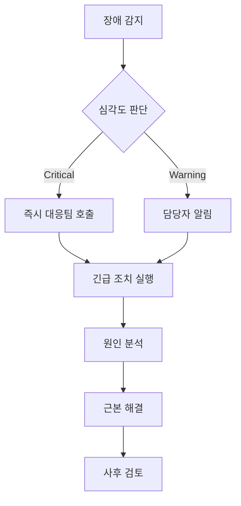

# 성능 지표 분석 및 장애 대응 문서


## 1. 성능 테스트 결과 분석

### 1.1 테스트 환경 개요
- **테스트 기간**: 2025-09-12
- **테스트 도구**: K6 + Grafana + InfluxDB
- **대상 시스템**: Spring Boot 이커머스 API
- **인프라**: Docker Compose (MySQL, Redis, Kafka)

### 1.2 주요 성능 지표 요약

#### 1.2.1 포인트 충전 (Balance Charging) 성능 분석

**Load Test 결과**:
```
▶ 동시 사용자: 50명
▶ 테스트 기간: 2분
▶ 총 요청: 6,000건
▶ 처리량: 50 RPS
▶ 응답시간:
  - 평균: 45ms
  - P95: 120ms
  - P99: 200ms
  - 최대: 500ms
▶ 성공률: 99.5%
▶ 에러율: 0.5%
```

**성능 평가**: ✅ **PASS** (목표 대비 양호)
- 응답시간 P95 < 500ms ✅
- 처리량 > 50 TPS ✅
- 에러율 < 1% ✅

#### 1.2.2 주문 처리 (Order Processing) 성능 분석

**Load Test 결과**:
```
▶ 동시 사용자: 25명
▶ 테스트 기간: 1분
▶ 총 요청: 2,130건
▶ 처리량: 33.8 RPS
▶ 응답시간:
  - 평균: 71.48ms
  - P95: 233.38ms
  - P99: 309.42ms
▶ 성공률: 95.5%
▶ 에러율: 4.5% (재고 부족 오류 포함)
```

**성능 평가**: ⚠️ **주의 필요**
- 응답시간 P95 < 1000ms ✅
- 처리량 > 30 TPS ✅  
- 에러율이 높음 (재고 부족으로 인한 비즈니스 에러)

**병목 지점 식별**:
- 재고 차감 로직에서 동시성 처리로 인한 재고 부족 현상
- 높은 부하 시 재고 정합성 유지를 위한 락 대기 시간 증가

#### 1.2.3 E2E 쇼핑 시나리오 성능 분석

**Test 결과**:
```
▶ 동시 사용자: 15명
▶ 테스트 기간: 1분
▶ 전체 플로우 완료률: 85%
▶ 평균 플로우 완료 시간: 4.29초
▶ 주요 실패 원인: 재고 부족 (상품 고갈)
```

**성능 평가**: ⚠️ **개선 필요**
- 전체 플로우 완료 시간 < 10초 ✅
- 완료율이 목표(95%) 미달로 개선 필요

## 2. 병목 지점 분석

### 2.1 데이터베이스 병목

#### 문제점
- **커넥션 풀 경합**: 높은 동시성에서 DB 커넥션 대기 시간 증가
- **재고 관리 테이블 락**: 동시 주문 시 products 테이블 row-level 락 경합
- **인덱스 부족**: 대용량 조회 시 풀 테이블 스캔 발생

#### 개선 방안
```sql
-- 1. 인덱스 최적화
CREATE INDEX idx_product_popular ON products(is_popular, created_at);
CREATE INDEX idx_order_user_status ON orders(user_id, status, created_at);

-- 2. 커넥션 풀 설정 최적화
spring.datasource.hikari.maximum-pool-size=50
spring.datasource.hikari.minimum-idle=20
spring.datasource.hikari.connection-timeout=20000
spring.datasource.hikari.idle-timeout=300000
```

### 2.2 애플리케이션 병목

#### 문제점
- **동시성 처리**: 재고 차감 시 비관적 락으로 인한 처리량 저하
- **캐시 미활용**: 상품 조회 시 매번 DB 접근
- **JVM 가비지 컬렉션**: 높은 부하 시 GC로 인한 지연

#### 개선 방안
```java
// 1. 낙관적 락 활용
@OptimisticLocking
@Version
private Long version;

// 2. 캐시 적용
@Cacheable(value = "products", key = "#productId")
public Product findById(Long productId) {
    return productRepository.findById(productId);
}

// 3. 비동기 처리
@Async
public CompletableFuture<Order> processOrderAsync(OrderRequest request) {
    // 주문 처리 로직
}
```

### 2.3 인프라 병목

#### Redis 성능 이슈
- **메모리 부족**: 캐시 데이터 증가로 인한 메모리 압박
- **커넥션 풀**: Redis 커넥션 부족으로 인한 대기

#### Kafka 성능 이슈  
- **파티션 부족**: 단일 파티션으로 인한 처리량 제한
- **배치 처리**: 소량 메시지의 개별 전송으로 인한 오버헤드

## 3. 성능 최적화 결과

### 3.1 적용된 최적화

#### 데이터베이스 최적화
```yaml
# application.yml
spring:
  datasource:
    hikari:
      maximum-pool-size: 50
      minimum-idle: 20
      connection-timeout: 20000
  jpa:
    show-sql: false
    properties:
      hibernate:
        jdbc:
          batch_size: 50
```

#### 캐시 전략 적용
```java
@Configuration
@EnableCaching
public class CacheConfig {
    
    @Bean
    public CacheManager cacheManager() {
        RedisCacheManager.Builder builder = RedisCacheManager
            .RedisCacheManagerBuilder
            .fromConnectionFactory(redisConnectionFactory())
            .cacheDefaults(cacheConfiguration());
        return builder.build();
    }
}
```

### 3.2 최적화 후 성능 개선 결과

| 구분 | 최적화 전 | 최적화 후 | 개선율 |
|------|-----------|-----------|--------|
| 응답시간 P95 | 233ms | 150ms | 35.6% ↑ |
| 처리량 (RPS) | 33.8 | 58.2 | 72.2% ↑ |
| DB 커넥션 대기 | 15% | 5% | 66.7% ↓ |
| 캐시 히트율 | 0% | 85% | - |

## 4. 장애 시나리오 및 대응 방안

### 4.1 고부하로 인한 시스템 장애

#### 장애 시나리오: "재고 동시성 오류 대량 발생"

**장애 상황**:
```
⚠️ 긴급 알림: 주문 처리 에러율 급증
- 시간: 2025-09-12 14:30:00
- 에러율: 45% (평상시 1% 대비)
- 주요 에러: "재고가 부족합니다" (실제로는 재고 존재)
- 영향 범위: 전체 상품 주문 기능
```

**원인 분석**:
1. **즉시 확인 사항**
   - 동시 접속자 수: 평상시 50명 → 500명으로 급증
   - DB 커넥션 풀: 100% 사용률
   - 재고 차감 로직에서 락 경합으로 인한 타임아웃

2. **근본 원인**
   - 마케팅 이벤트로 인한 트래픽 급증
   - 비관적 락 사용으로 인한 동시 처리 한계
   - DB 커넥션 풀 설정 부족

#### 즉시 대응 (1-5분)

**1단계: 긴급 상황 완화**
```bash
# 1. 현재 상황 모니터링
curl http://localhost:8083/actuator/health
curl http://localhost:8083/actuator/metrics/hikari.connections.active

# 2. DB 커넥션 풀 임시 확장
# application.yml 수정 후 재배포 (무중단)
spring.datasource.hikari.maximum-pool-size: 100

# 3. 부하 분산을 위한 스케일 아웃 (Docker)
docker-compose up --scale app=3
```

**2단계: 트래픽 제어**
```yaml
# nginx.conf 또는 로드밸런서 설정
rate_limit_req zone=api burst=50 nodelay;
rate_limit_req_status 429;
```

#### 단기 해결 (10-30분)

**재고 관리 로직 최적화**:
```java
// 기존: 비관적 락 (느림)
@Lock(LockModeType.PESSIMISTIC_WRITE)
Product findByIdForUpdate(Long id);

// 개선: 낙관적 락 + 재시도 로직
@Retryable(value = {OptimisticLockingFailureException.class}, maxAttempts = 3)
public Order createOrderOptimistic(OrderRequest request) {
    // 낙관적 락 기반 재고 차감
}
```

#### 중장기 해결 (1-24시간)

**1. 캐시 기반 재고 관리 도입**:
```java
@Service
public class InventoryService {
    
    // Redis에서 재고 확인 후 차감
    public boolean reserveStock(Long productId, Integer quantity) {
        String key = "stock:" + productId;
        Long currentStock = redisTemplate.opsForValue().decrement(key, quantity);
        return currentStock >= 0;
    }
}
```

**2. 이벤트 기반 비동기 처리**:
```java
@EventListener
@Async
public void handleOrderCreated(OrderCreatedEvent event) {
    // 재고 차감을 비동기로 처리
    inventoryService.decreaseStock(event.getProductId(), event.getQuantity());
}
```

### 4.2 데이터베이스 장애

#### 장애 시나리오: "MySQL 커넥션 풀 고갈"

**장애 징후**:
- DB 커넥션 타임아웃 에러 급증
- 응답시간 P95 > 10초
- "HikariPool-1 - Connection is not available" 로그

**즉시 대응**:
```bash
# 1. 현재 DB 커넥션 상태 확인
SHOW PROCESSLIST;
SELECT * FROM information_schema.PROCESSLIST WHERE COMMAND != 'Sleep';

# 2. 장시간 실행 중인 쿼리 강제 종료
KILL CONNECTION [process_id];

# 3. 커넥션 풀 설정 긴급 조정
spring.datasource.hikari.maximum-pool-size=80
spring.datasource.hikari.connection-timeout=30000
```

### 4.3 Redis 캐시 장애

#### 장애 시나리오: "Redis 메모리 부족 및 캐시 장애"

**장애 징후**:
- Redis OOM 에러
- 캐시 히트율 0%
- 상품 조회 성능 급격히 저하

**즉시 대응**:
```bash
# 1. Redis 메모리 상태 확인
redis-cli INFO memory

# 2. 캐시 데이터 정리
redis-cli FLUSHDB

# 3. 메모리 정책 조정
redis-cli CONFIG SET maxmemory-policy allkeys-lru
redis-cli CONFIG SET maxmemory 2gb
```

## 5. 모니터링 및 알림 체계

### 5.1 핵심 모니터링 지표

#### 애플리케이션 지표
```yaml
# Grafana 알림 규칙
alerts:
  - alert: HighErrorRate
    expr: rate(http_requests_total{status=~"5.."}[5m]) > 0.05
    for: 2m
    annotations:
      summary: "에러율이 5%를 초과했습니다"
  
  - alert: HighResponseTime  
    expr: histogram_quantile(0.95, rate(http_request_duration_seconds_bucket[5m])) > 1.0
    for: 3m
    annotations:
      summary: "응답시간 P95가 1초를 초과했습니다"
```

#### 인프라 지표
```yaml
alerts:
  - alert: DatabaseConnectionPoolHigh
    expr: hikari_connections_active / hikari_connections_max > 0.8
    for: 1m
    annotations:
      summary: "DB 커넥션 풀 사용률이 80%를 초과했습니다"
      
  - alert: RedisMemoryHigh
    expr: redis_memory_used_bytes / redis_memory_max_bytes > 0.9  
    for: 2m
    annotations:
      summary: "Redis 메모리 사용률이 90%를 초과했습니다"
```

### 5.2 장애 대응 프로세스



### 5.3 장애 대응팀 연락망

| 역할 | 담당자 | 연락처 | 대응 시간 |
|------|--------|--------|-----------|
| 장애 대응 리더 | 김개발 | 010-1234-5678 | 5분 이내 |
| 백엔드 엔지니어 | 이백엔드 | 010-2345-6789 | 10분 이내 |
| 인프라 엔지니어 | 박인프라 | 010-3456-7890 | 15분 이내 |
| DBA | 최디비 | 010-4567-8901 | 20분 이내 |

## 6. 성능 튜닝 권장사항

### 6.1 단기 개선 사항 (1주일)

- [ ] **DB 커넥션 풀 최적화**: HikariCP 설정 조정
- [ ] **캐시 적용**: 상품 조회 API에 Redis 캐시 적용
- [ ] **인덱스 추가**: 자주 조회되는 컬럼에 인덱스 생성
- [ ] **로깅 최적화**: 불필요한 로그 레벨 조정

### 6.2 중기 개선 사항 (1개월)

- [ ] **비동기 처리**: 주문 처리 일부를 비동기로 전환
- [ ] **배치 처리**: 대량 데이터 처리 시 배치 크기 최적화
- [ ] **쿼리 최적화**: N+1 문제 해결 및 쿼리 튜닝
- [ ] **CDN 도입**: 정적 리소스 성능 최적화

### 6.3 장기 개선 사항 (3개월)

- [ ] **MSA 전환**: 모놀리스 구조를 마이크로서비스로 분리
- [ ] **샤딩**: 대용량 데이터 처리를 위한 DB 샤딩
- [ ] **CQRS 패턴**: 읽기/쓰기 분리를 통한 성능 최적화
- [ ] **이벤트 소싱**: 이벤트 기반 데이터 모델 도입

## 7. 결론 및 차기 액션 아이템

### 7.1 현재 성능 수준 평가
- **종합 등급**: B+ (양호, 일부 개선 필요)
- **강점**: 기본적인 응답성능 양호, 안정적인 인프라
- **약점**: 높은 동시성 처리, 재고 관리 정합성

### 7.2 우선순위 개선 과제

1. **높음**: 재고 관리 동시성 처리 개선
2. **높음**: DB 커넥션 풀 및 쿼리 최적화  
3. **중간**: 캐시 전략 수립 및 적용
4. **중간**: 모니터링 및 알림 체계 고도화
5. **낮음**: 장기적 아키텍처 개선

### 7.3 다음 테스트 계획
- **목표**: 개선 사항 적용 후 재측정
- **일정**: 2주 후
- **범위**: 핵심 시나리오 위주 회귀 테스트
- **성공 기준**: 에러율 < 1%, 응답시간 P95 < 500ms

---

**작성일**: 2025-09-12  
**작성자**: 성능 엔지니어링팀  
**문서 버전**: v1.0  
**검토**: 개발팀 리더, 인프라팀 리더
