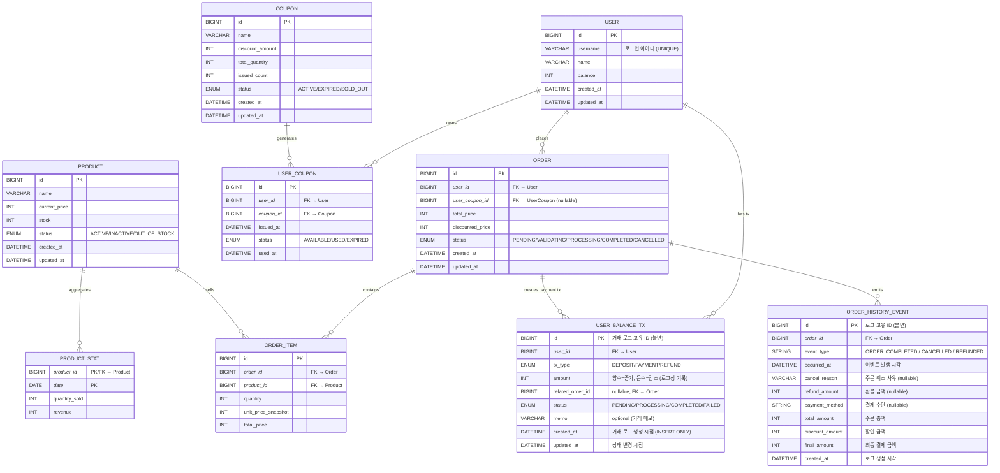

# ERD

```mermaid
erDiagram
    USER {
        BIGINT id PK
        VARCHAR username "로그인 아이디 (UNIQUE)"
        VARCHAR name
        INT balance
        DATETIME created_at
        DATETIME updated_at
    }

    PRODUCT {
        BIGINT id PK
        VARCHAR name
        INT current_price
        INT stock
        ENUM status "ACTIVE/INACTIVE/OUT_OF_STOCK"
        DATETIME created_at
        DATETIME updated_at
    }

    COUPON {
        BIGINT id PK
        VARCHAR name
        INT discount_amount
        INT total_quantity
        INT issued_count
        ENUM status "ACTIVE/EXPIRED/SOLD_OUT"
        DATETIME created_at
        DATETIME updated_at
    }

    USER_COUPON {
        BIGINT id PK
        BIGINT _user_id_    "FK → User"
        BIGINT _coupon_id_  "FK → Coupon"
        DATETIME issued_at
        ENUM status "AVAILABLE/USED/EXPIRED"
        DATETIME used_at
    }

    ORDER {
        BIGINT id PK
        BIGINT _user_id_      "FK → User"
        BIGINT _user_coupon_id_    "FK → UserCoupon (nullable)"
        INT total_price
        INT discounted_price
        ENUM status "PENDING/VALIDATING/PROCESSING/COMPLETED/CANCELLED"
        DATETIME created_at
        DATETIME updated_at
    }

    ORDER_ITEM {
        BIGINT id PK
        BIGINT _order_id_   "FK → Order"
        BIGINT _product_id_ "FK → Product"
        INT quantity
        INT unit_price_snapshot
        INT total_price
    }

%% 로그성 테이블: 주문 이력 이벤트 (INSERT ONLY, 이벤트 소싱)
    ORDER_HISTORY_EVENT {
        BIGINT id PK "로그 고유 ID (불변)"
        BIGINT _order_id_ "FK → Order"
        STRING event_type "ORDER_COMPLETED / CANCELLED / REFUNDED"
        DATETIME occurred_at "이벤트 발생 시각"
        VARCHAR cancel_reason "주문 취소 사유 (nullable)"
        INT refund_amount "환불 금액 (nullable)"
        STRING payment_method "결제 수단 (nullable)"
        INT total_amount "주문 총액"
        INT discount_amount "할인 금액"
        INT final_amount "최종 결제 금액"
        DATETIME created_at "로그 생성 시각"
    }


%% 🔥 로그성 테이블: 사용자 잔액 거래 내역 (INSERT ONLY, 감사 추적)
    USER_BALANCE_TX {
        BIGINT id PK "거래 로그 고유 ID (불변)"
        BIGINT _user_id_        "FK → User"
        ENUM  tx_type           "DEPOSIT/PAYMENT/REFUND"
        INT   amount            "양수=증가, 음수=감소 (로그성 기록)"
        BIGINT related_order_id "nullable, FK → Order"
        ENUM status "PENDING/PROCESSING/COMPLETED/FAILED"
        VARCHAR memo            "optional (거래 메모)"
        DATETIME created_at     "거래 로그 생성 시점 (INSERT ONLY)"
        DATETIME updated_at     "상태 변경 시점"
    }

    PRODUCT_STAT {
        BIGINT _product_id_ "PK/FK → Product"
        DATE   _date_       "PK"
        INT quantity_sold
        INT revenue
    }

%% 관계 정의
    USER ||--o{ USER_BALANCE_TX : "has tx"
    USER ||--o{ "ORDER"         : places
    USER ||--o{ USER_COUPON     : owns
    COUPON ||--o{ USER_COUPON   : generates

    "ORDER" ||--o{ ORDER_ITEM        : contains
    PRODUCT ||--o{ ORDER_ITEM        : sells
    "ORDER" ||--o{ ORDER_HISTORY_EVENT : emits
    "ORDER" ||--o{ USER_BALANCE_TX   : "creates payment tx"

%% Optional relations
    PRODUCT ||--o{ PRODUCT_STAT : "aggregates"

```
