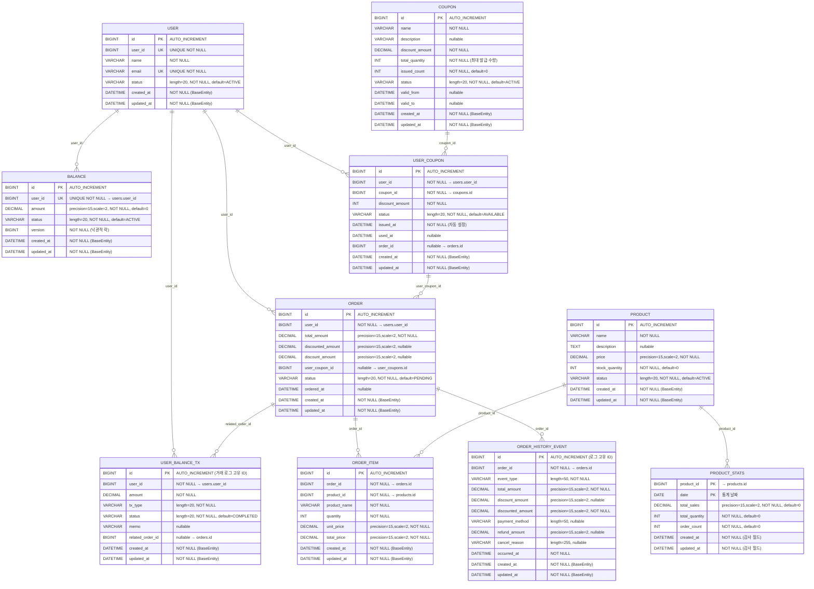

# ERD

## 📋 테이블 상세 정보

### 🏗️ **아키텍처 특징**
- **BaseEntity 상속**: 모든 엔티티가 공통 감사 필드를 상속받음
- **논리적 외래키**: 물리적 FK 제약조건 없이 논리적 관계만 유지
- **동시성 제어**: Balance 테이블에 낙관적 락 적용
- **이벤트 소싱**: INSERT ONLY 로그 테이블 활용

### 📊 **테이블별 상세 정보**

#### **1. users (사용자)**
- **테이블명**: `users`
- **주요 특징**: 
  - `user_id`: 비즈니스 식별자 (UNIQUE)
  - `email`: 이메일 주소 (UNIQUE)
- **상태값**: ACTIVE, INACTIVE, SUSPENDED

#### **2. balances (잔액)**
- **테이블명**: `balances`
- **주요 특징**:
  - `user_id`: users.user_id와 1:1 관계
  - `version`: 낙관적 락으로 동시성 제어
  - `amount`: precision=15, scale=2로 정확한 금액 관리
- **상태값**: ACTIVE, INACTIVE

#### **3. products (상품)**
- **테이블명**: `products`
- **주요 특징**:
  - `stock_quantity`: 재고 수량 관리
  - `price`: 현재 판매 가격
- **상태값**: ACTIVE, INACTIVE, SOLD_OUT

#### **4. coupons (쿠폰)**
- **테이블명**: `coupons`
- **주요 특징**:
  - `total_quantity`: 최대 발급 가능 수량
  - `issued_count`: 현재 발급된 수량
  - `valid_from/to`: 쿠폰 유효 기간
- **상태값**: ACTIVE, INACTIVE, SOLD_OUT, EXPIRED

#### **5. user_coupons (사용자 쿠폰)**
- **테이블명**: `user_coupons`
- **주요 특징**:
  - 사용자별 발급된 쿠폰 관리
  - `issued_at`: 발급 시점 자동 기록
  - `used_at`: 사용 시점 기록
- **상태값**: AVAILABLE, USED, EXPIRED

#### **6. orders (주문)**
- **테이블명**: `orders`
- **주요 특징**:
  - `total_amount`: 원래 주문 금액
  - `discount_amount`: 할인 금액
  - `discounted_amount`: 최종 결제 금액
- **상태값**: PENDING, VALIDATING, PROCESSING, COMPLETED, CANCELLED, FAILED

#### **7. order_items (주문 상품)**
- **테이블명**: `order_items`
- **주요 특징**:
  - `product_name`: 주문 시점의 상품명 스냅샷
  - `unit_price`: 주문 시점의 단가 스냅샷
  - `total_price`: 계산된 총 금액

### 🔄 **로그성 테이블 (INSERT ONLY)**

#### **8. user_balance_tx (잔액 거래 내역)**
- **테이블명**: `user_balance_tx`
- **주요 특징**:
  - 모든 잔액 변동 내역 기록
  - `related_order_id`: 주문과 연관된 거래 추적
- **거래 타입**: DEPOSIT, PAYMENT, REFUND
- **상태값**: PENDING, PROCESSING, COMPLETED, FAILED

#### **9. order_history_events (주문 이력)**
- **테이블명**: `order_history_events`
- **주요 특징**:
  - 주문 관련 모든 이벤트 추적
  - 이벤트 소싱 패턴 적용
- **이벤트 타입**: ORDER_COMPLETED, CANCELLED, REFUNDED

### 📈 **통계 테이블**

#### **10. product_stats (상품 통계)**
- **테이블명**: `product_stats`
- **주요 특징**:
  - 복합키: (product_id, date)
  - 일별 상품 판매 통계 집계
  - BaseEntity 상속하지 않음 (독립적인 감사 필드)

### 🔒 **제약조건 및 인덱스**

#### **UNIQUE 제약조건**
- `users.user_id`: 비즈니스 식별자 유일성
- `users.email`: 이메일 주소 유일성  
- `balances.user_id`: 사용자당 하나의 잔액 계정

#### **복합키**
- `product_stats`: (product_id, date)

#### **동시성 제어**
- `balances.version`: 낙관적 락으로 동시 수정 방지

### 📝 **설계 원칙**

1. **논리적 외래키**: 성능과 유연성을 위해 물리적 FK 제약조건 미적용
2. **이벤트 소싱**: 중요한 비즈니스 이벤트를 로그 테이블로 추적
3. **감사 추적**: 모든 금액 변동과 주문 변경 이력 보존
4. **스냅샷 패턴**: 주문 시점의 상품 정보를 별도 저장
5. **상태 관리**: 각 엔티티별 명확한 상태 전환 규칙 적용
