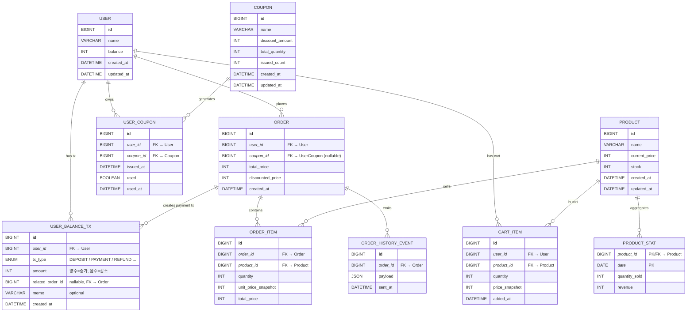

# ERD

```mermaid
erDiagram
    USER {
        BIGINT **id**
        VARCHAR name
        INT balance
        DATETIME created_at
        DATETIME updated_at
    }

    PRODUCT {
        BIGINT **id**
        VARCHAR name
        INT current_price
        INT stock
        DATETIME created_at
        DATETIME updated_at
    }

    COUPON {
        BIGINT **id**
        VARCHAR name
        INT discount_amount
        INT total_quantity
        INT issued_count
        DATETIME created_at
        DATETIME updated_at
    }

    USER_COUPON {
        BIGINT **id**
        BIGINT _user_id_    "FK → User"
        BIGINT _coupon_id_  "FK → Coupon"
        DATETIME issued_at
        BOOLEAN used
        DATETIME used_at
    }

    "ORDER" {
        BIGINT **id**
        BIGINT _user_id_      "FK → User"
        BIGINT _coupon_id_    "FK → UserCoupon (nullable)"
        INT total_price
        INT discounted_price
        DATETIME created_at
    }

    ORDER_ITEM {
        BIGINT **id**
        BIGINT _order_id_   "FK → Order"
        BIGINT _product_id_ "FK → Product"
        INT quantity
        INT unit_price_snapshot
        INT total_price
    }

    ORDER_HISTORY_EVENT {
        BIGINT **id**
        BIGINT _order_id_ "FK → Order"
        JSON  payload
        DATETIME sent_at
    }

    %% 🔹 신규: 잔액 트랜잭션 테이블
    USER_BALANCE_TX {
        BIGINT **id**
        BIGINT _user_id_        "FK → User"
        ENUM  tx_type           "DEPOSIT / PAYMENT / REFUND ..."
        INT   amount            "양수=증가, 음수=감소"
        BIGINT related_order_id "nullable, FK → Order"
        VARCHAR memo            "optional"
        DATETIME created_at
    }

    %% 선택(Optional) 테이블
    CART_ITEM {
        BIGINT **id**
        BIGINT _user_id_    "FK → User"
        BIGINT _product_id_ "FK → Product"
        INT quantity
        INT price_snapshot
        DATETIME added_at
    }

    PRODUCT_STAT {
        BIGINT _product_id_ "PK/FK → Product"
        DATE   _date_       "PK"
        INT quantity_sold
        INT revenue
    }

    %% 관계 정의
    USER ||--o{ USER_BALANCE_TX : "has tx"
    USER ||--o{ "ORDER"         : places
    USER ||--o{ USER_COUPON     : owns
    COUPON ||--o{ USER_COUPON   : generates

    "ORDER" ||--o{ ORDER_ITEM        : contains
    PRODUCT ||--o{ ORDER_ITEM        : sells
    "ORDER" ||--o{ ORDER_HISTORY_EVENT : emits
    "ORDER" ||--o{ USER_BALANCE_TX   : "creates payment tx"

    %% Optional relations
    USER ||--o{ CART_ITEM : "has cart"
    PRODUCT ||--o{ CART_ITEM : "in cart"
    PRODUCT ||--o{ PRODUCT_STAT : "aggregates"
```
