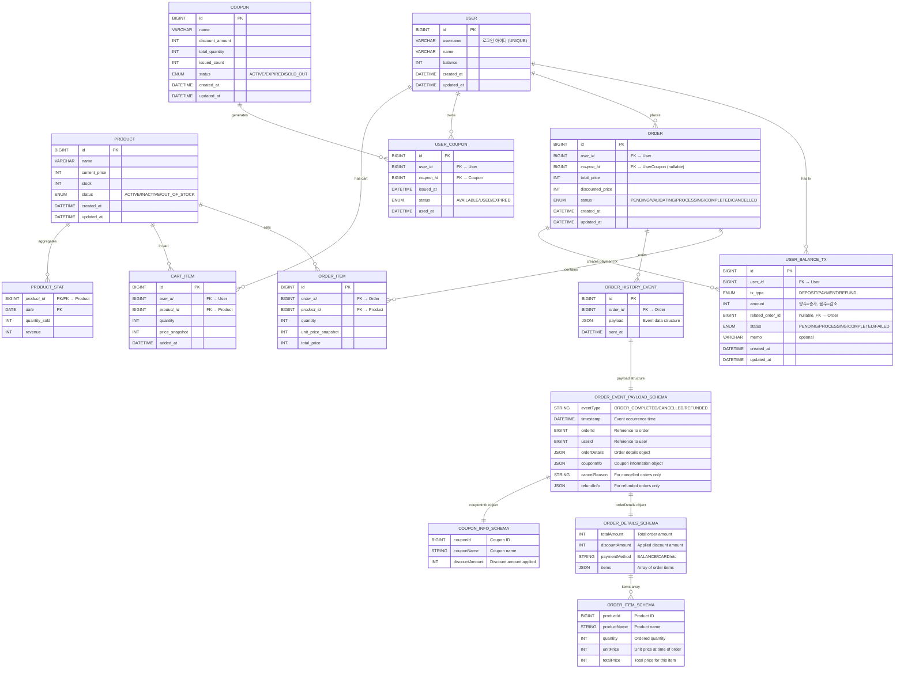

# ERD

```mermaid
erDiagram
    USER {
        BIGINT id PK
        VARCHAR username "로그인 아이디 (UNIQUE)"
        VARCHAR name
        INT balance
        DATETIME created_at
        DATETIME updated_at
    }

    PRODUCT {
        BIGINT id PK
        VARCHAR name
        INT current_price
        INT stock
        ENUM status "ACTIVE/INACTIVE/OUT_OF_STOCK"
        DATETIME created_at
        DATETIME updated_at
    }

    COUPON {
        BIGINT id PK
        VARCHAR name
        INT discount_amount
        INT total_quantity
        INT issued_count
        ENUM status "ACTIVE/EXPIRED/SOLD_OUT"
        DATETIME created_at
        DATETIME updated_at
    }

    USER_COUPON {
        BIGINT id PK
        BIGINT _user_id_    "FK → User"
        BIGINT _coupon_id_  "FK → Coupon"
        DATETIME issued_at
        ENUM status "AVAILABLE/USED/EXPIRED"
        DATETIME used_at
    }

    ORDER {
        BIGINT id PK
        BIGINT _user_id_      "FK → User"
        BIGINT _coupon_id_    "FK → UserCoupon (nullable)"
        INT total_price
        INT discounted_price
        ENUM status "PENDING/VALIDATING/PROCESSING/COMPLETED/CANCELLED"
        DATETIME created_at
        DATETIME updated_at
    }

    ORDER_ITEM {
        BIGINT id PK
        BIGINT _order_id_   "FK → Order"
        BIGINT _product_id_ "FK → Product"
        INT quantity
        INT unit_price_snapshot
        INT total_price
    }

    ORDER_HISTORY_EVENT {
        BIGINT id PK
        BIGINT _order_id_ "FK → Order"
        JSON payload "Event data structure"
        DATETIME sent_at
    }


    %% JSON 페이로드 구조 스키마 (문서화 목적)
    ORDER_EVENT_PAYLOAD_SCHEMA {
        STRING eventType "ORDER_COMPLETED/CANCELLED/REFUNDED"
        DATETIME timestamp "Event occurrence time"
        BIGINT orderId "Reference to order"
        BIGINT userId "Reference to user"
        JSON orderDetails "Order details object"
        JSON couponInfo "Coupon information object"
        STRING cancelReason "For cancelled orders only"
        JSON refundInfo "For refunded orders only"
    }

    %% orderDetails 객체 구조
    ORDER_DETAILS_SCHEMA {
        INT totalAmount "Total order amount"
        INT discountAmount "Applied discount amount"
        STRING paymentMethod "BALANCE/CARD/etc"
        JSON items "Array of order items"
    }

    %% orderDetails.items 배열 구조
    ORDER_ITEM_SCHEMA {
        BIGINT productId "Product ID"
        STRING productName "Product name"
        INT quantity "Ordered quantity"
        INT unitPrice "Unit price at time of order"
        INT totalPrice "Total price for this item"
    }

    %% couponInfo 객체 구조
    COUPON_INFO_SCHEMA {
        BIGINT couponId "Coupon ID"
        STRING couponName "Coupon name"
        INT discountAmount "Discount amount applied"
    }

    USER_BALANCE_TX {
        BIGINT id PK
        BIGINT _user_id_        "FK → User"
        ENUM  tx_type           "DEPOSIT/PAYMENT/REFUND"
        INT   amount            "양수=증가, 음수=감소"
        BIGINT related_order_id "nullable, FK → Order"
        ENUM status "PENDING/PROCESSING/COMPLETED/FAILED"
        VARCHAR memo            "optional"
        DATETIME created_at
        DATETIME updated_at
    }

    CART_ITEM {
        BIGINT id PK
        BIGINT _user_id_    "FK → User"
        BIGINT _product_id_ "FK → Product"
        INT quantity
        INT price_snapshot
        DATETIME added_at
    }

    PRODUCT_STAT {
        BIGINT _product_id_ "PK/FK → Product"
        DATE   _date_       "PK"
        INT quantity_sold
        INT revenue
    }

    %% 관계 정의
    USER ||--o{ USER_BALANCE_TX : "has tx"
    USER ||--o{ "ORDER"         : places
    USER ||--o{ USER_COUPON     : owns
    COUPON ||--o{ USER_COUPON   : generates

    "ORDER" ||--o{ ORDER_ITEM        : contains
    PRODUCT ||--o{ ORDER_ITEM        : sells
    "ORDER" ||--o{ ORDER_HISTORY_EVENT : emits
    "ORDER" ||--o{ USER_BALANCE_TX   : "creates payment tx"

    %% Optional relations
    USER ||--o{ CART_ITEM : "has cart"
    PRODUCT ||--o{ CART_ITEM : "in cart"
    PRODUCT ||--o{ PRODUCT_STAT : "aggregates"

    %% JSON 스키마 관계 (논리적 관계)
    ORDER_HISTORY_EVENT ||--|| ORDER_EVENT_PAYLOAD_SCHEMA : "payload structure"
    ORDER_EVENT_PAYLOAD_SCHEMA ||--|| ORDER_DETAILS_SCHEMA : "orderDetails object"
    ORDER_EVENT_PAYLOAD_SCHEMA ||--|| COUPON_INFO_SCHEMA : "couponInfo object"
    ORDER_DETAILS_SCHEMA ||--o{ ORDER_ITEM_SCHEMA : "items array"
```
