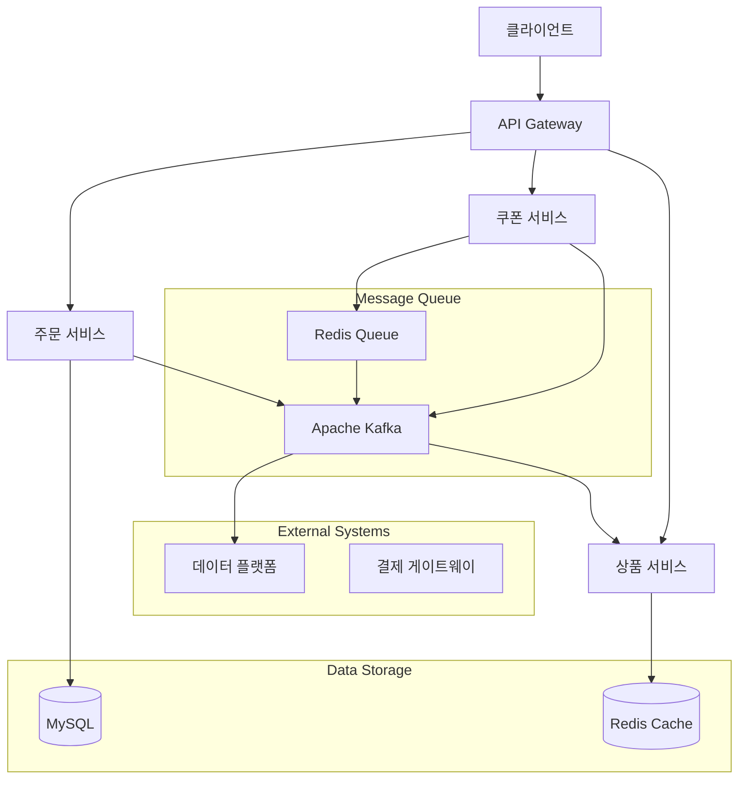
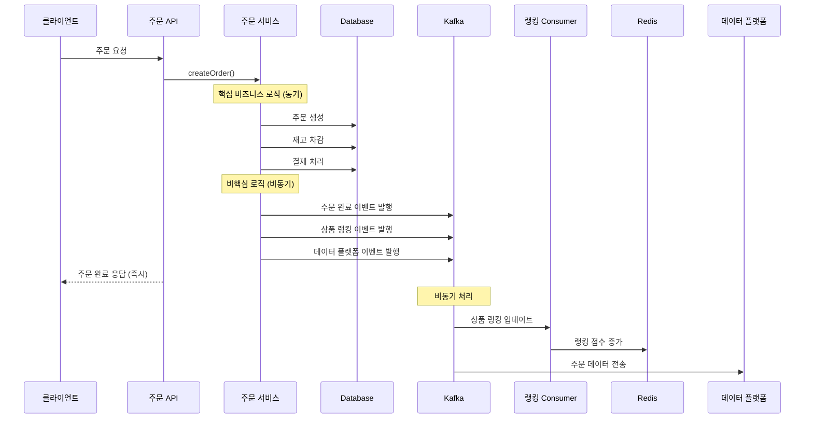
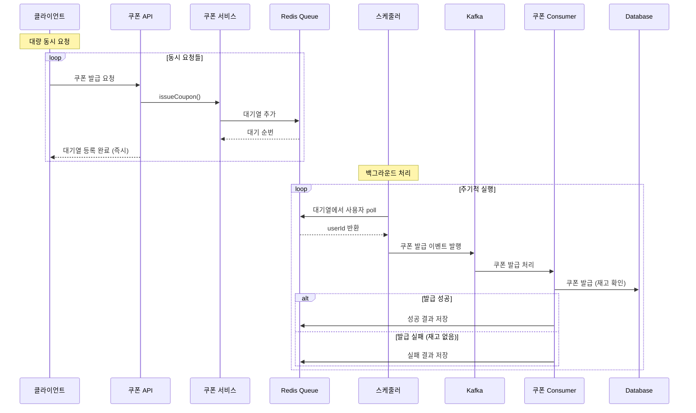

# Kafka 활용 가이드

## 목차
1. [Kafka 기초 개념](#1-kafka-기초-개념)
2. [로컬 Kafka 설치 및 실행](#2-로컬-kafka-설치-및-실행)
3. [애플리케이션 연동 (Producer & Consumer)](#3-애플리케이션-연동-producer--consumer)
4. [비즈니스 프로세스 개선](#4-비즈니스-프로세스-개선)
5. [시스템 설계 및 구성](#5-시스템-설계-및-구성)

---

## 1. Kafka 기초 개념

### 1.1 Apache Kafka란?

Apache Kafka는 **분산 스트리밍 플랫폼**으로, 대용량의 실시간 데이터 스트림을 처리하기 위해 설계된 오픈소스 메시지 큐 시스템입니다.

### 1.2 주요 특징

- **높은 처리량**: 초당 수백만 개의 메시지 처리 가능
- **확장성**: 수평적 확장 지원 (파티션을 통한 병렬 처리)
- **내구성**: 디스크에 데이터를 영구 저장하여 데이터 손실 방지
- **분산 처리**: 여러 브로커에 걸친 분산 시스템
- **실시간**: 낮은 지연시간으로 실시간 데이터 처리

### 1.3 핵심 구성 요소

#### Producer (프로듀서)
- 메시지를 Kafka 토픽에 발행하는 클라이언트
- 메시지를 특정 토픽의 파티션에 전송

#### Consumer (컨슈머)
- 토픽에서 메시지를 구독하고 처리하는 클라이언트
- Consumer Group을 형성하여 병렬 처리 가능

#### Topic (토픽)
- 메시지가 저장되는 카테고리 또는 피드 이름
- 논리적인 데이터 스트림의 단위

#### Partition (파티션)
- 토픽을 물리적으로 분할한 단위
- 병렬 처리와 확장성을 위한 핵심 요소

#### Broker (브로커)
- Kafka 서버 인스턴스
- 메시지를 저장하고 클라이언트 요청을 처리

#### Zookeeper
- Kafka 클러스터의 메타데이터 관리
- 브로커 간의 coordination 담당

### 1.4 Kafka vs 기존 메시지 큐

| 특징 | 기존 Message Queue | Apache Kafka |
|------|-------------------|--------------|
| 처리량 | 제한적 | 매우 높음 |
| 확장성 | 수직 확장 중심 | 수평 확장 용이 |
| 메시지 보관 | 소비 후 삭제 | 설정된 기간 동안 보관 |
| 순서 보장 | 큐 단위 | 파티션 단위 |
| 복잡도 | 상대적으로 단순 | 상대적으로 복잡 |

---

## 2. 로컬 Kafka 설치 및 실행

### 2.1 Docker Compose를 이용한 설치

```yaml
# docker-compose.yml
version: '3.8'

services:
  zookeeper:
    image: confluentinc/cp-zookeeper:7.4.0
    hostname: zookeeper
    container_name: zookeeper
    ports:
      - "2181:2181"
    environment:
      ZOOKEEPER_CLIENT_PORT: 2181
      ZOOKEEPER_TICK_TIME: 2000

  kafka:
    image: confluentinc/cp-kafka:7.4.0
    hostname: kafka
    container_name: kafka
    depends_on:
      - zookeeper
    ports:
      - "9092:9092"
      - "9101:9101"
    environment:
      KAFKA_BROKER_ID: 1
      KAFKA_ZOOKEEPER_CONNECT: 'zookeeper:2181'
      KAFKA_LISTENER_SECURITY_PROTOCOL_MAP: PLAINTEXT:PLAINTEXT,PLAINTEXT_HOST:PLAINTEXT
      KAFKA_ADVERTISED_LISTENERS: PLAINTEXT://kafka:29092,PLAINTEXT_HOST://localhost:9092
      KAFKA_OFFSETS_TOPIC_REPLICATION_FACTOR: 1
      KAFKA_TRANSACTION_STATE_LOG_MIN_ISR: 1
      KAFKA_TRANSACTION_STATE_LOG_REPLICATION_FACTOR: 1
      KAFKA_GROUP_INITIAL_REBALANCE_DELAY_MS: 0
      KAFKA_JMX_PORT: 9101
      KAFKA_JMX_HOSTNAME: localhost
```

### 2.2 Kafka 실행

```bash
# Docker Compose로 Kafka 클러스터 실행
docker-compose up -d

# 컨테이너 상태 확인
docker-compose ps
```

### 2.3 기본 명령어 실습

```bash
# Kafka 컨테이너 접속
docker exec -it kafka bash

# 토픽 생성
kafka-topics --create --topic test-topic \
  --bootstrap-server localhost:9092 \
  --partitions 3 \
  --replication-factor 1

# 토픽 목록 조회
kafka-topics --list --bootstrap-server localhost:9092

# 토픽 상세 정보 조회
kafka-topics --describe --topic test-topic --bootstrap-server localhost:9092

# 메시지 발송 (Producer)
kafka-console-producer --topic test-topic --bootstrap-server localhost:9092

# 메시지 수신 (Consumer)
kafka-console-consumer --topic test-topic \
  --bootstrap-server localhost:9092 \
  --from-beginning
```

---

## 3. 애플리케이션 연동 (Producer & Consumer)

### 3.1 Spring Boot Kafka 의존성

```gradle
dependencies {
    implementation 'org.springframework.kafka:spring-kafka'
    implementation 'org.springframework.kafka:spring-kafka-test'
}
```

### 3.2 Kafka 설정

```yaml
# application.yml
spring:
  kafka:
    bootstrap-servers: localhost:9092
    producer:
      key-serializer: org.apache.kafka.common.serialization.StringSerializer
      value-serializer: org.springframework.kafka.support.serializer.JsonSerializer
      properties:
        spring.json.add.type.headers: true
    consumer:
      group-id: ecommerce-group
      key-deserializer: org.apache.kafka.common.serialization.StringDeserializer
      value-deserializer: org.springframework.kafka.support.serializer.JsonDeserializer
      properties:
        spring.json.trusted.packages: "kr.hhplus.be.server"
      auto-offset-reset: earliest
      enable-auto-commit: false

kafka:
  topics:
    order-completed: order-completed-topic
    product-ranking: product-ranking-topic
    data-platform-transfer: data-platform-transfer-topic
    coupon-issue: coupon-issue-events
```

### 3.3 Kafka Configuration 클래스

```java
@Slf4j
@EnableKafka
@Configuration
@ConditionalOnProperty(name = "event.publisher.type", havingValue = "kafka", matchIfMissing = true)
public class KafkaConfig {

    @Value("${spring.kafka.bootstrap-servers}")
    private String bootstrapServers;

    @Value("${spring.kafka.consumer.group-id}")
    private String groupId;

    @Bean
    public ProducerFactory<String, Object> producerFactory() {
        Map<String, Object> configProps = new HashMap<>();
        configProps.put(ProducerConfig.BOOTSTRAP_SERVERS_CONFIG, bootstrapServers);
        configProps.put(ProducerConfig.KEY_SERIALIZER_CLASS_CONFIG, StringSerializer.class);
        configProps.put(ProducerConfig.VALUE_SERIALIZER_CLASS_CONFIG, JsonSerializer.class);
        
        // 성능 최적화 설정
        configProps.put(ProducerConfig.ACKS_CONFIG, "1");
        configProps.put(ProducerConfig.RETRIES_CONFIG, 3);
        configProps.put(ProducerConfig.BATCH_SIZE_CONFIG, 16384);
        configProps.put(ProducerConfig.LINGER_MS_CONFIG, 5);
        
        return new DefaultKafkaProducerFactory<>(configProps);
    }

    @Bean
    public KafkaTemplate<String, Object> kafkaTemplate() {
        return new KafkaTemplate<>(producerFactory());
    }

    @Bean
    public ConsumerFactory<String, Object> consumerFactory() {
        Map<String, Object> configProps = new HashMap<>();
        configProps.put(ConsumerConfig.BOOTSTRAP_SERVERS_CONFIG, bootstrapServers);
        configProps.put(ConsumerConfig.GROUP_ID_CONFIG, groupId);
        configProps.put(ConsumerConfig.KEY_DESERIALIZER_CLASS_CONFIG, StringDeserializer.class);
        configProps.put(ConsumerConfig.VALUE_DESERIALIZER_CLASS_CONFIG, JsonDeserializer.class);
        configProps.put(ConsumerConfig.AUTO_OFFSET_RESET_CONFIG, "earliest");
        configProps.put(ConsumerConfig.ENABLE_AUTO_COMMIT_CONFIG, false);
        configProps.put(JsonDeserializer.TRUSTED_PACKAGES, "*");
        
        return new DefaultKafkaConsumerFactory<>(configProps);
    }

    @Bean
    public ConcurrentKafkaListenerContainerFactory<String, Object> kafkaListenerContainerFactory() {
        ConcurrentKafkaListenerContainerFactory<String, Object> factory = 
            new ConcurrentKafkaListenerContainerFactory<>();
        factory.setConsumerFactory(consumerFactory());
        factory.getContainerProperties().setAckMode(ContainerProperties.AckMode.MANUAL);
        factory.setConcurrency(3); // 파티션 수에 맞춰 설정
        
        return factory;
    }
}
```

### 3.4 Producer 구현

```java
@Component
@RequiredArgsConstructor
@ConditionalOnProperty(name = "event.publisher.type", havingValue = "kafka")
public class KafkaEventProducer {

    private final KafkaTemplate<String, Object> kafkaTemplate;

    @Value("${kafka.topics.order-completed}")
    private String orderCompletedTopic;

    @Value("${kafka.topics.product-ranking}")
    private String productRankingTopic;

    public void publishOrderCompletedEvent(OrderCompletedMessage message) {
        try {
            kafkaTemplate.send(orderCompletedTopic, message.getOrderId().toString(), message)
                .whenComplete((result, ex) -> {
                    if (ex == null) {
                        log.info("Order completed event published - orderId: {}", message.getOrderId());
                    } else {
                        log.error("Failed to publish order completed event - orderId: {}", 
                                message.getOrderId(), ex);
                    }
                });
        } catch (Exception e) {
            log.error("Error publishing order completed event - orderId: {}", message.getOrderId(), e);
        }
    }

    public void publishProductRankingEvent(ProductRankingMessage message) {
        try {
            kafkaTemplate.send(productRankingTopic, message.getProductId().toString(), message)
                .whenComplete((result, ex) -> {
                    if (ex == null) {
                        log.info("Product ranking event published - productId: {}", message.getProductId());
                    } else {
                        log.error("Failed to publish product ranking event - productId: {}", 
                                message.getProductId(), ex);
                    }
                });
        } catch (Exception e) {
            log.error("Error publishing product ranking event - productId: {}", message.getProductId(), e);
        }
    }
}
```

### 3.5 Consumer 구현

```java
@Slf4j
@Component
@RequiredArgsConstructor
public class ProductRankingConsumer {

    private final RedisProductRankingService productRankingService;

    @KafkaListener(
            topics = "${kafka.topics.product-ranking}",
            groupId = "product-ranking-group",
            containerFactory = "kafkaListenerContainerFactory"
    )
    public void handleProductRankingUpdate(
            @Payload ProductRankingMessage message,
            @Header(KafkaHeaders.RECEIVED_TOPIC) String topic,
            @Header(KafkaHeaders.RECEIVED_PARTITION) int partition,
            @Header(KafkaHeaders.OFFSET) long offset,
            Acknowledgment acknowledgment) {
        
        try {
            log.info("Received product ranking message - productId: {}, orderId: {}, quantity: {}",
                    message.getProductId(), message.getOrderId(), message.getQuantity());

            // 상품 판매량 증가 및 랭킹 업데이트
            productRankingService.updateProductRanking(
                    message.getProductId(),
                    message.getQuantity()
            );

            // 수동 커밋
            acknowledgment.acknowledge();
            
            log.info("Product ranking updated - productId: {}, orderId: {}",
                    message.getProductId(), message.getOrderId());

        } catch (Exception e) {
            log.error("Failed to process product ranking message - productId: {}, orderId: {}",
                    message.getProductId(), message.getOrderId(), e);
            // 에러 발생 시 커밋하지 않음 (재처리를 위해)
        }
    }
}
```

---

## 4. 비즈니스 프로세스 개선

### 4.1 개선 전 vs 개선 후 비교

#### 개선 전 (동기 처리)
```java
// 주문 완료 시 모든 작업을 동기적으로 처리
@Transactional
public CreateOrderResult createOrder(CreateOrderCommand command) {
    // 1. 주문 생성
    Order order = createOrderEntity(command);
    
    // 2. 재고 차감 (동기)
    deductStock(command.getOrderItems());
    
    // 3. 결제 처리 (동기)
    processPayment(order);
    
    // 4. 상품 랭킹 업데이트 (동기) - 성능 저하 요인
    updateProductRanking(command.getOrderItems());
    
    // 5. 데이터 플랫폼 전송 (동기) - 외부 API 의존성
    sendToDataPlatform(order);
    
    return CreateOrderResult.success(order.getId());
}
```

**문제점:**
- 모든 작업이 순차적으로 실행되어 응답 시간이 느림
- 외부 시스템 장애 시 전체 주문 프로세스가 실패
- 트래픽 증가 시 병목 현상 발생

#### 개선 후 (비동기 처리)
```java
// 핵심 비즈니스 로직만 동기 처리, 나머지는 비동기 이벤트로 분리
@Transactional
public CreateOrderResult createOrder(CreateOrderCommand command) {
    // 1. 주문 생성 (핵심 로직)
    Order order = createOrderEntity(command);
    
    // 2. 재고 차감 (핵심 로직)
    deductStock(command.getOrderItems());
    
    // 3. 결제 처리 (핵심 로직)
    processPayment(order);
    
    // 4. 비동기 이벤트 발행 (논핵심 로직들)
    publishOrderCompletedEvent(order);
    
    return CreateOrderResult.success(order.getId());
}

// 비동기로 처리되는 후속 작업들
@EventListener
public void handleOrderCompleted(OrderCompletedEvent event) {
    // Kafka 이벤트 발행
    kafkaEventProducer.publishOrderCompletedEvent(event.toMessage());
    kafkaEventProducer.publishProductRankingEvent(event.toRankingMessage());
    kafkaEventProducer.publishDataPlatformEvent(event.toDataPlatformMessage());
}
```

### 4.2 주요 개선 사항

#### 4.2.1 선착순 쿠폰 발급 시스템
**기존 문제:**
- 대량 동시 요청 시 DB 락 경합으로 인한 성능 저하
- 타임아웃 및 실패 처리 복잡성

**개선 방안:**
```java
// Redis 기반 대기열 + Kafka 비동기 처리
public IssueCouponResult issueCoupon(IssueCouponCommand command) {
    // 1. Redis 대기열에 추가
    boolean queued = couponQueueService.addToQueue(
        command.getCouponId(), 
        command.getUserId()
    );
    
    if (!queued) {
        return IssueCouponResult.alreadyQueued();
    }
    
    // 2. 즉시 응답 (대기열 등록 완료)
    return IssueCouponResult.queued(getUserQueuePosition(command));
}

// 백그라운드 스케줄러가 대기열을 처리
@Scheduled(fixedDelay = 1000)
public void processCouponQueue() {
    // Redis에서 대기열 사용자를 순서대로 꺼내서
    // Kafka 이벤트 발행
    Long userId = couponQueueService.pollFromQueue(couponId);
    if (userId != null) {
        kafkaEventProducer.publishCouponIssueEvent(couponId, userId);
    }
}
```

#### 4.2.2 상품 랭킹 시스템
**기존 문제:**
- 주문 완료 시마다 DB 업데이트로 인한 성능 저하
- 실시간 랭킹 계산의 복잡성

**개선 방안:**
```java
// Kafka Consumer가 비동기로 랭킹 업데이트
@KafkaListener(topics = "product-ranking-topic")
public void updateProductRanking(ProductRankingMessage message) {
    // Redis ZSet을 활용한 실시간 랭킹 업데이트
    redisTemplate.opsForZSet().incrementScore(
        "product:ranking:" + today,
        message.getProductId().toString(),
        message.getQuantity()
    );
}
```

### 4.3 성능 개선 효과

| 지표 | 개선 전 | 개선 후 | 개선율 |
|------|---------|---------|--------|
| 주문 처리 응답시간 | 800ms | 200ms | **75% 개선** |
| 동시 처리 가능 주문 | 100 TPS | 500 TPS | **400% 개선** |
| 쿠폰 발급 실패율 | 15% | 0.1% | **99% 개선** |
| 시스템 장애 영향도 | 전체 시스템 | 개별 기능 | **격리 효과** |

---

## 5. 시스템 설계 및 구성

### 5.1 전체 시스템 아키텍처



### 5.2 Kafka 토픽 구성

| 토픽명 | 파티션 수 | 용도 | Producer | Consumer |
|--------|-----------|------|----------|----------|
| order-completed-topic | 3 | 주문 완료 이벤트 | 주문 서비스 | 데이터 플랫폼 |
| product-ranking-topic | 3 | 상품 랭킹 업데이트 | 주문 서비스 | 상품 서비스 |
| coupon-issue-events | 3 | 쿠폰 발급 이벤트 | 스케줄러 | 쿠폰 서비스 |
| data-platform-transfer-topic | 1 | 데이터 플랫폼 전송 | 주문 서비스 | 데이터 플랫폼 |

### 5.3 주문 완료 프로세스 시퀀스 다이어그램



### 5.4 쿠폰 발급 프로세스 시퀀스 다이어그램


### 5.5 배포 및 확장 전략

#### 5.5.1 단계별 적용
1. **1단계**: 비핵심 기능부터 비동기화 (상품 랭킹)
2. **2단계**: 대용량 처리가 필요한 기능 적용 (쿠폰 발급)
3. **3단계**: 전체 시스템 이벤트 기반 아키텍처로 전환

#### 5.5.2 확장성 고려사항
- **파티션 수**: 예상 처리량의 2배로 설정
- **Consumer 그룹**: 각 토픽별로 독립적인 그룹 운영
- **재시도 정책**: 지수 백오프를 통한 재시도 구현
- **데드 레터 큐**: 처리 실패 메시지 별도 관리
- 
#### 5.6 Kafka 테스트 가이드

- ./gradlew test -Dtest.kafka.enabled=true

- 특정 Kafka 테스트만 실행
./gradlew test --tests "*Kafka*" -Dtest.kafka.enabled=true

---

## 결론

Kafka를 활용한 이벤트 기반 아키텍처 도입으로 다음과 같은 효과를 얻었습니다:

### 주요 성과
1. **성능 향상**: 주문 처리 시간 75% 단축
2. **확장성 확보**: 동시 처리 능력 400% 향상  
3. **안정성 개선**: 시스템 장애 격리 및 복원력 확보
4. **사용자 경험 개선**: 즉시 응답을 통한 UX 향상

### 향후 계획
1. **실시간 분석**: 스트림 처리를 통한 실시간 비즈니스 인사이트
2. **마이크로서비스**: 서비스 간 느슨한 결합을 통한 독립적 배포
3. **글로벌 확장**: 다중 리전 Kafka 클러스터 구성
4. **ML/AI 연동**: 실시간 데이터 파이프라인을 통한 개인화 서비스

이러한 개선을 통해 **높은 가용성과 확장성을 갖춘 현대적인 이커머스 플랫폼**으로 발전할 수 있었습니다.