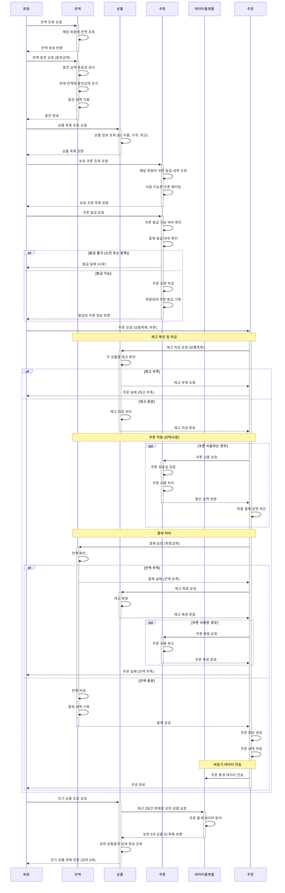

# 시퀀스 다이어그램

- 잔액 조회
- 잔액 충전
- 상품 조회
- 보유 쿠폰 조회
- 선착순 쿠폰 발급 요청
- 주문 요청
- 인기 상품 조회 요청

```mermaid
sequenceDiagram
    participant User as 회원
    participant Balance as 잔액
    participant Product as 상품
    participant Coupon as 쿠폰
    participant DataPlatform as 데이터플랫폼
    participant Order as 주문

        User->>+Balance: 잔액 조회 요청
        Balance->>Balance: 해당 회원의 잔액 조회
        Balance-->>-User: 잔액 정보 반환

        User->>+Balance: 잔액 충전 요청 (충전금액)
        Balance->>Balance: 충전 금액 유효성 검사
        Balance->>Balance: 현재 잔액에 충전금액 추가
        Balance->>Balance: 충전 내역 기록
        Balance-->>-User: 충전 완료

        User->>+Product: 상품 목록 조회 요청
        Product->>Product: 상품 정보 조회 (ID, 이름, 가격, 재고)
        Product-->>-User: 상품 목록 반환

        User->>+Coupon: 보유 쿠폰 조회 요청
        Coupon->>Coupon: 해당 회원의 쿠폰 발급 내역 조회
        Coupon->>Coupon: 사용 가능한 쿠폰 필터링
        Coupon-->>-User: 보유 쿠폰 목록 반환

        User->>+Coupon: 쿠폰 발급 요청
        Coupon->>Coupon: 쿠폰 발급 가능 여부 확인
        Coupon->>Coupon: 중복 발급 여부 확인

        alt 발급 불가 (소진 또는 중복)
            Coupon-->>User: 발급 실패 (사유)
        else 발급 가능
            Coupon->>Coupon: 쿠폰 수량 차감
            Coupon->>Coupon: 회원에게 쿠폰 발급 기록
            Coupon-->>-User: 발급된 쿠폰 정보 반환
        end

        User->>+Order: 주문 요청 (상품목록, 쿠폰)

        Note over Order, Balance: 재고 확인 및 차감
        Order->>+Product: 재고 차감 요청 (상품목록)
        Product->>Product: 각 상품별 재고 확인

        alt 재고 부족
            Product-->>Order: 재고 부족 오류
            Order-->>User: 주문 실패 (재고 부족)
        else 재고 충분
            Product->>Product: 재고 차감 처리
            Product-->>-Order: 재고 차감 완료

            Note over Order, Balance: 쿠폰 적용 (선택사항)
            opt 쿠폰 사용하는 경우
                Order->>+Coupon: 쿠폰 사용 요청
                Coupon->>Coupon: 쿠폰 유효성 검증
                Coupon->>Coupon: 쿠폰 사용 처리
                Coupon-->>-Order: 할인 금액 반환
                Order->>Order: 최종 결제 금액 계산
            end

            Note over Order, Balance: 결제 처리
            Order->>+Balance: 결제 요청 (최종금액)
            Balance->>Balance: 잔액 확인

            alt 잔액 부족
                Balance-->>Order: 결제 실패 (잔액 부족)
                Order->>+Product: 재고 복원 요청
                Product->>Product: 재고 복원
                Product-->>-Order: 재고 복원 완료
                opt 쿠폰 사용한 경우
                    Order->>+Coupon: 쿠폰 복원 요청
                    Coupon->>Coupon: 쿠폰 사용 취소
                    Coupon-->>-Order: 쿠폰 복원 완료
                end
                Order-->>User: 주문 실패 (잔액 부족)
            else 잔액 충분
                Balance->>Balance: 잔액 차감
                Balance->>Balance: 결제 내역 기록
                Balance-->>-Order: 결제 성공

                Order->>Order: 주문 정보 생성
                Order->>Order: 주문 내역 저장

                Note over Order, DataPlatform: 비동기 데이터 전송
                Order->>DataPlatform: 주문 통계 데이터 전송

                Order-->>-User: 주문 완료
            end
        end

        User->>+Product: 인기 상품 조회 요청
        Product->>+DataPlatform: 최근 3일간 판매량 상위 상품 요청
        DataPlatform->>DataPlatform: 주문 통계 데이터 분석
        DataPlatform-->>-Product: 상위 5개 상품 ID 목록 반환
        Product->>Product: 상위 상품들의 상세 정보 조회
        Product-->>-User: 인기 상품 목록 반환 (상위 5개)
```
