# 이커머스 시퀀스 다이어그램 - ERD 연동

## 1️⃣ 잔액 조회 API

```mermaid
sequenceDiagram
    participant User as 회원
    participant Balance as 잔액

    User->>+Balance: 잔액 조회 요청
    Balance->>Balance: 해당 회원의 잔액 조회
    Balance-->>-User: 잔액 정보 반환
```

## 1️⃣ 잔액 충전 API

```mermaid
sequenceDiagram
    participant User as 회원
    participant Balance as 잔액
    participant BalanceTx as 잔액거래내역

    User->>+Balance: 잔액 충전 요청 (충전금액)
    Balance->>Balance: 충전 금액 유효성 검사
    Balance->>Balance: 현재 잔액에 충전금액 추가 (USER.balance 업데이트)
    Balance->>+BalanceTx: 충전 내역 기록 (USER_BALANCE_TX 생성)
    BalanceTx->>BalanceTx: tx_type=DEPOSIT, amount=+충전금액
    BalanceTx-->>-Balance: 거래내역 저장 완료
    Balance-->>-User: 충전 완료된 잔액 정보 반환
```

## 2️⃣ 상품 조회 API

```mermaid
sequenceDiagram
    participant User as 회원
    participant Product as 상품

    User->>+Product: 상품 목록 조회 요청
    Product->>Product: 상품 정보 조회 (ID, 이름, 가격, 재고)
    Product-->>-User: 상품 목록 반환
```

## 3️⃣ 보유 쿠폰 조회 API

```mermaid
sequenceDiagram
    participant User as 회원
    participant Coupon as 쿠폰

    User->>+Coupon: 보유 쿠폰 조회 요청
    Coupon->>Coupon: 해당 회원의 쿠폰 발급 내역 조회
    Coupon->>Coupon: 사용 가능한 쿠폰 필터링
    Coupon-->>-User: 보유 쿠폰 목록 반환
```

## 3️⃣ 선착순 쿠폰 발급 API

```mermaid
sequenceDiagram
    participant User as 회원
    participant Coupon as 쿠폰
    participant UserCoupon as 사용자쿠폰

    User->>+Coupon: 쿠폰 발급 요청
    Coupon->>Coupon: 쿠폰 발급 가능 여부 확인 (total_quantity > issued_count)
    Coupon->>+UserCoupon: 중복 발급 여부 확인 (USER_COUPON 테이블 조회)
    UserCoupon-->>-Coupon: 발급 내역 조회 결과

    alt 발급 불가 (소진 또는 중복)
        Coupon-->>User: 발급 실패 (사유)
    else 발급 가능
        Coupon->>Coupon: 쿠폰 수량 차감 (COUPON.issued_count += 1)
        Coupon->>+UserCoupon: 회원에게 쿠폰 발급 기록 (USER_COUPON 생성)
        UserCoupon->>UserCoupon: user_id, coupon_id, issued_at, used=false 저장
        UserCoupon-->>-Coupon: 발급 기록 완료
        Coupon-->>-User: 발급된 쿠폰 정보 반환
    end
```

## 4️⃣ 주문/결제 API

```mermaid
sequenceDiagram
    participant User as 회원
    participant Order as 주문
    participant OrderItem as 주문항목
    participant Product as 상품
    participant Coupon as 쿠폰
    participant UserCoupon as 사용자쿠폰
    participant Balance as 잔액
    participant BalanceTx as 잔액거래내역
    participant DataPlatform as 데이터플랫폼
    participant OrderEvent as 주문이벤트

    User->>+Order: 주문 요청 (상품목록, 쿠폰)

    Note over Order, Balance: 재고 확인 및 차감
    Order->>+Product: 재고 차감 요청 (상품목록)
    Product->>Product: 각 상품별 재고 확인 (PRODUCT.stock)

    alt 재고 부족
        Product-->>Order: 재고 부족 오류
        Order-->>User: 주문 실패 (재고 부족)
    else 재고 충분
        Product->>Product: 재고 차감 처리 (PRODUCT.stock -= quantity)
        Product-->>-Order: 재고 차감 완료

        Note over Order, Balance: 주문 생성
        Order->>+OrderItem: 주문 항목 생성 (ORDER_ITEM 테이블)
        OrderItem->>OrderItem: 수량, 단가 스냅샷 저장
        OrderItem-->>-Order: 주문 항목 생성 완료

        Note over Order, Balance: 쿠폰 적용 (선택사항)
        opt 쿠폰 사용하는 경우
            Order->>+UserCoupon: 쿠폰 사용 요청
            UserCoupon->>UserCoupon: 쿠폰 유효성 검증 (used=false 확인)
            UserCoupon->>UserCoupon: 쿠폰 사용 처리 (used=true, used_at 업데이트)
            UserCoupon-->>-Order: 할인 금액 반환
            Order->>Order: 최종 결제 금액 계산 (ORDER.discounted_price 설정)
        end

        Note over Order, Balance: 결제 처리
        Order->>+Balance: 결제 요청 (최종금액)
        Balance->>Balance: 잔액 확인 (USER.balance)

        alt 잔액 부족
            Balance-->>Order: 결제 실패 (잔액 부족)
            Order->>+Product: 재고 복원 요청
            Product->>Product: 재고 복원 (PRODUCT.stock += quantity)
            Product-->>-Order: 재고 복원 완료
            opt 쿠폰 사용한 경우
                Order->>+UserCoupon: 쿠폰 복원 요청
                UserCoupon->>UserCoupon: 쿠폰 사용 취소 (used=false, used_at=null)
                UserCoupon-->>-Order: 쿠폰 복원 완료
            end
            Order-->>User: 주문 실패 (잔액 부족)
        else 잔액 충분
            Balance->>Balance: 잔액 차감 (USER.balance -= amount)
            Balance->>+BalanceTx: 결제 내역 기록 (USER_BALANCE_TX 생성)
            BalanceTx->>BalanceTx: tx_type=PAYMENT, amount=-결제금액, related_order_id 설정
            BalanceTx-->>-Balance: 거래내역 저장 완료
            Balance-->>-Order: 결제 성공

            Order->>Order: 주문 정보 저장 (ORDER 테이블에 최종 저장)

            Note over Order, DataPlatform: 비동기 데이터 전송
            Order->>+OrderEvent: 주문 이벤트 기록 (ORDER_HISTORY_EVENT)
            OrderEvent->>OrderEvent: payload에 주문 데이터 JSON 저장
            OrderEvent-->>-Order: 이벤트 저장 완료
            Order->>DataPlatform: 주문 통계 데이터 전송 (비동기)

            Order-->>-User: 주문 완료
        end
    end
```

## 5️⃣ 인기 상품 조회 API

```mermaid
sequenceDiagram
    participant User as 회원
    participant Product as 상품
    participant DataPlatform as 데이터플랫폼

    User->>+Product: 인기 상품 조회 요청
    Product->>+DataPlatform: 최근 3일간 판매량 상위 상품 요청
    DataPlatform->>DataPlatform: 주문 통계 데이터 분석
    DataPlatform-->>-Product: 상위 5개 상품 ID 목록 반환
    Product->>Product: 상위 상품들의 상세 정보 조회
    Product-->>-User: 인기 상품 목록 반환 (상위 5개)
```

## 📊 통계 데이터 수집 (배치)

```mermaid
sequenceDiagram
    participant Scheduler as 스케줄러
    participant Order as 주문
    participant DataPlatform as 데이터플랫폼

    Note over Scheduler, DataPlatform: 매일 새벽 실행
    Scheduler->>+Order: 일일 판매량 집계 요청
    Order->>Order: 전일 상품별 판매량 집계
    Order->>+DataPlatform: 집계된 통계 데이터 전송
    DataPlatform->>DataPlatform: 통계 데이터 저장 및 분석
    DataPlatform-->>-Order: 저장 완료
    Order-->>-Scheduler: 집계 작업 완료
```

