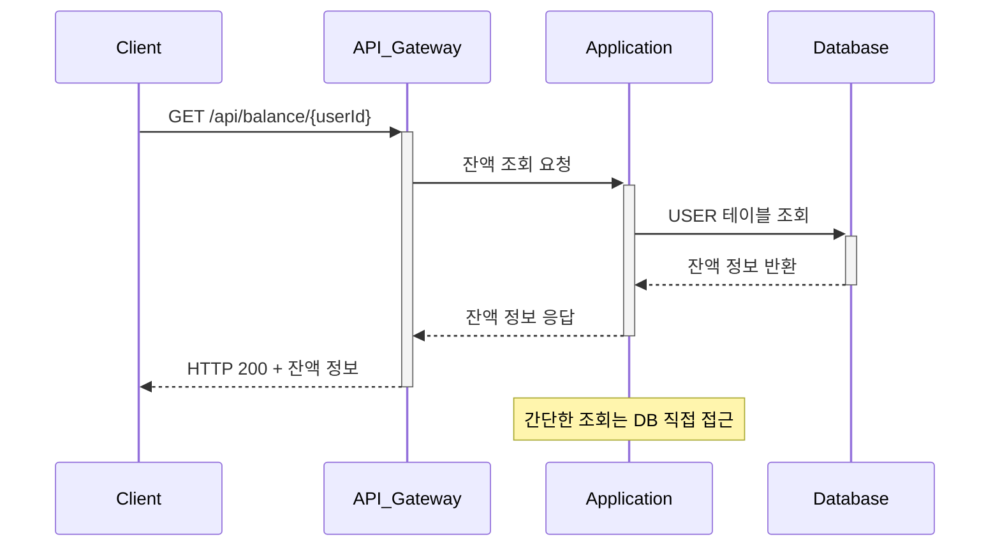
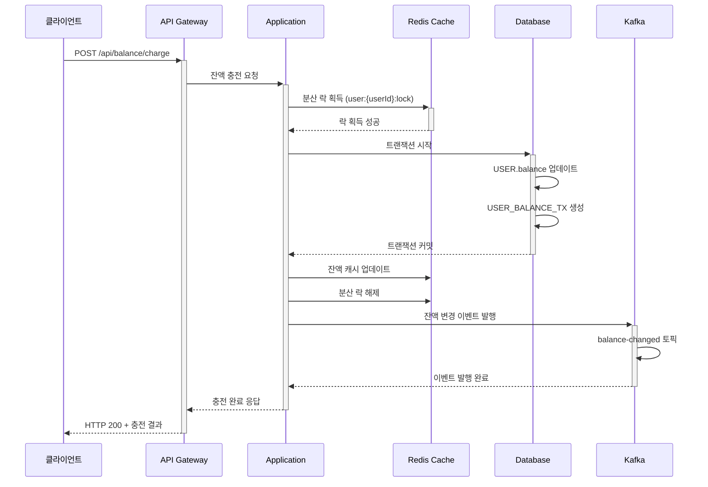
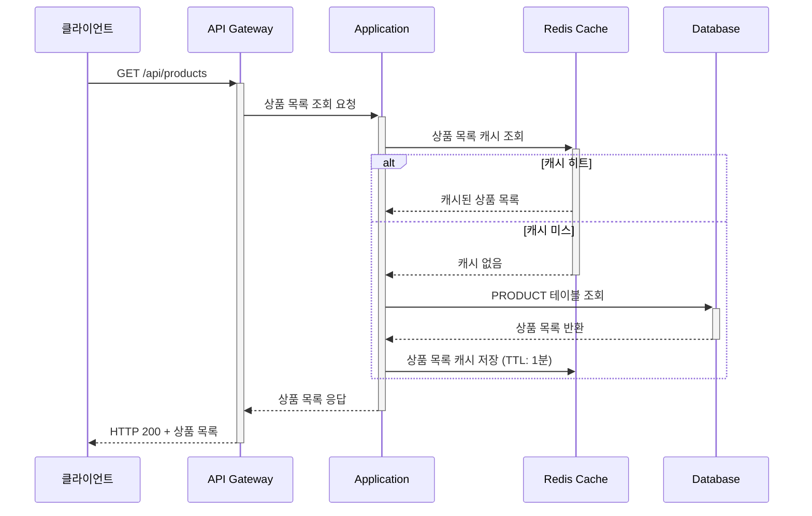
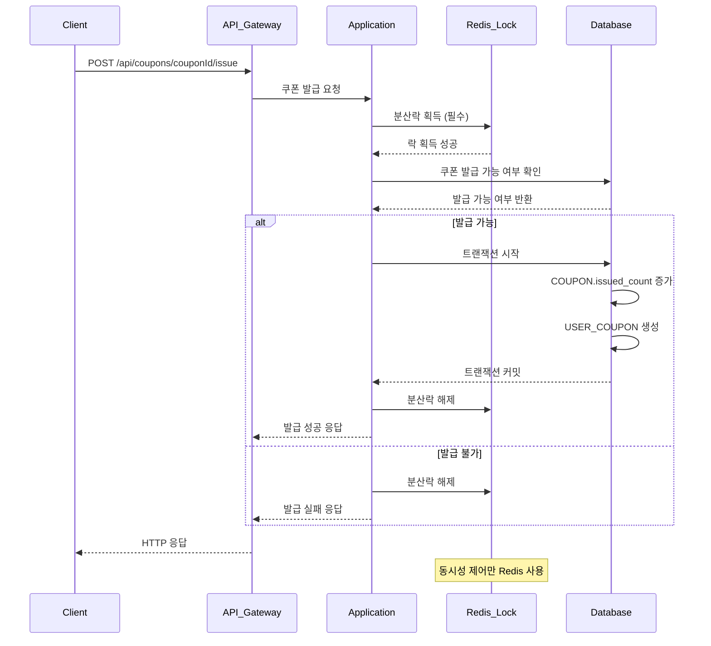
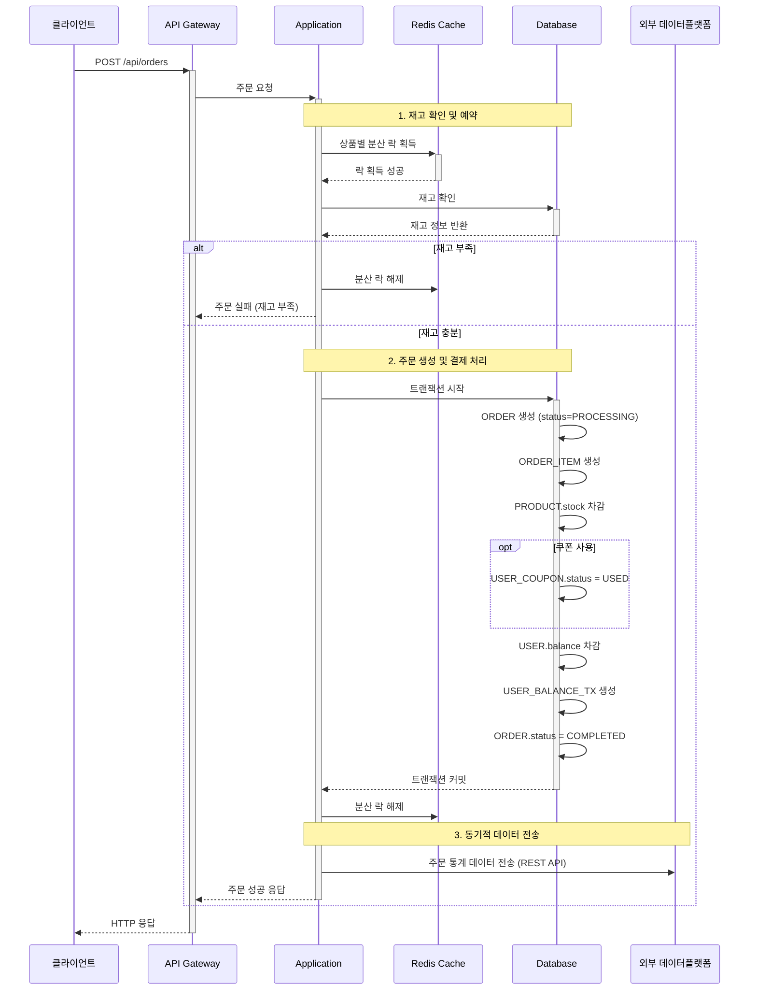
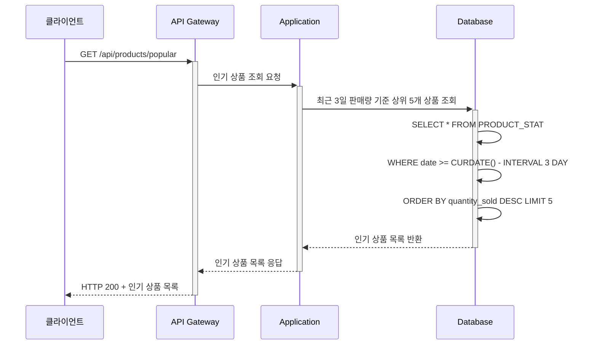
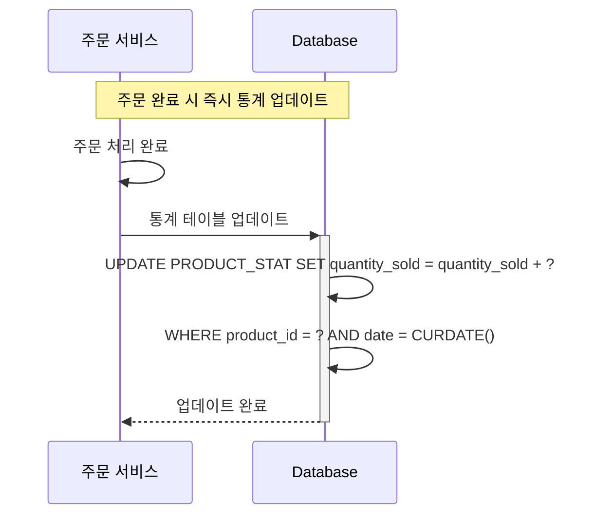

# 기술적 계층 기준 시퀀스 다이어그램 (Redis + Kafka)

## 1️⃣ 잔액 조회 API

## 1️⃣ 잔액 충전 API

## 2️⃣ 상품 조회 API

## 3️⃣ 선착순 쿠폰 발급 API

## 4️⃣ 주문/결제 API

## 5️⃣ 인기 상품 조회 API

## 📊 실시간 통계 처리 (Kafka Consumer)

## 🔹 기술적 계층 구성

### **1. 프레젠테이션 계층**
- **API Gateway**: 라우팅, 인증, 로드밸런싱
- **Client**: 웹/모바일 클라이언트

### **2. 애플리케이션 계층**
- **Application Service**: 비즈니스 로직 처리
- **분산 락 관리**: Redis 기반 동시성 제어

### **3. 캐싱 계층**
- **Redis Cache**:
    - 잔액/상품 정보 캐시
    - 실시간 통계 저장
    - 분산 락 구현

### **4. 메시징 계층**
- **Kafka**:
    - 이벤트 스트리밍
    - 비동기 처리
    - 시스템 간 디커플링

### **5. 데이터 계층**
- **Database**: 영구 데이터 저장
- **외부 데이터플랫폼**: 분석 및 통계
