# 시퀀스 다이어그램

## 1️⃣ 잔액 조회 API

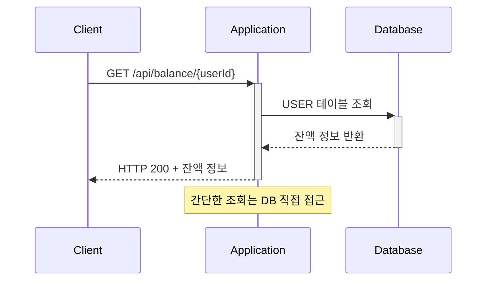

## 1️⃣ 잔액 충전 API

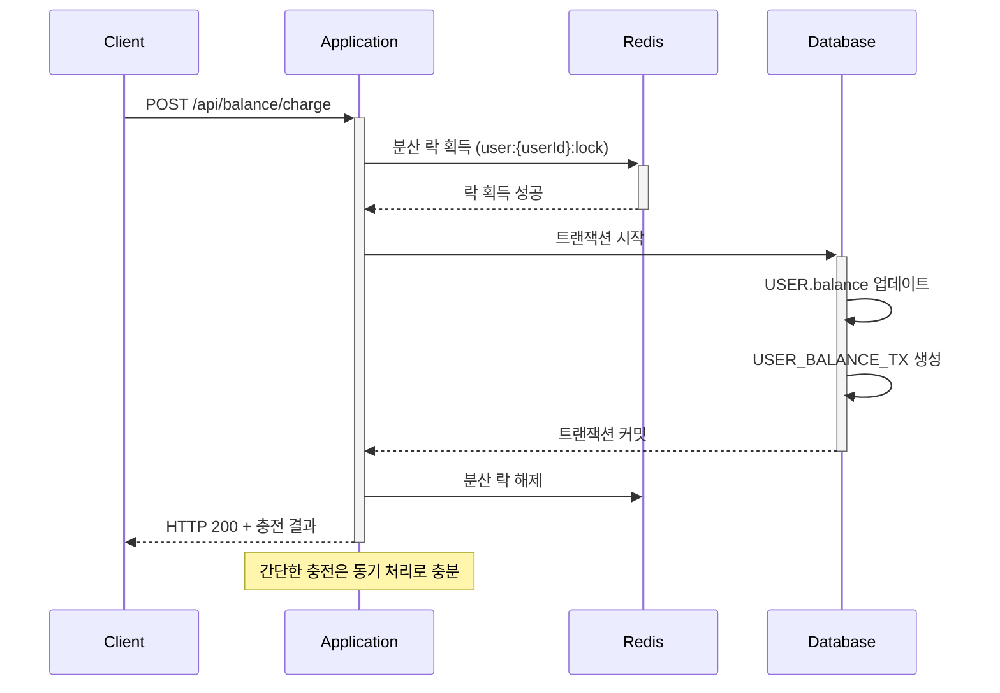

## 2️⃣ 상품 조회 API

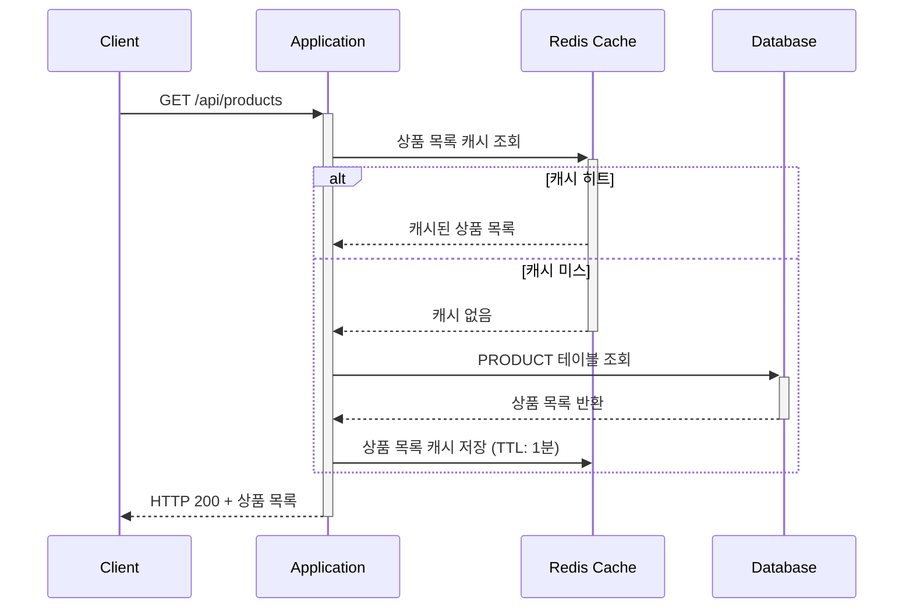

## 3️⃣ 보유 쿠폰 조회 API

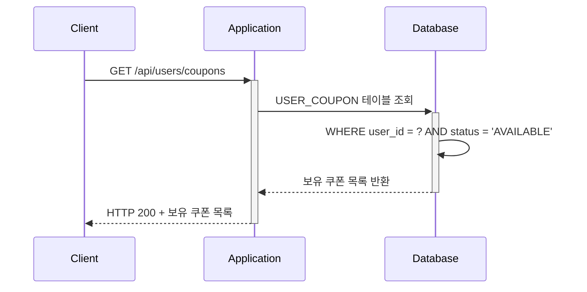

## 3️⃣ 선착순 쿠폰 발급 API

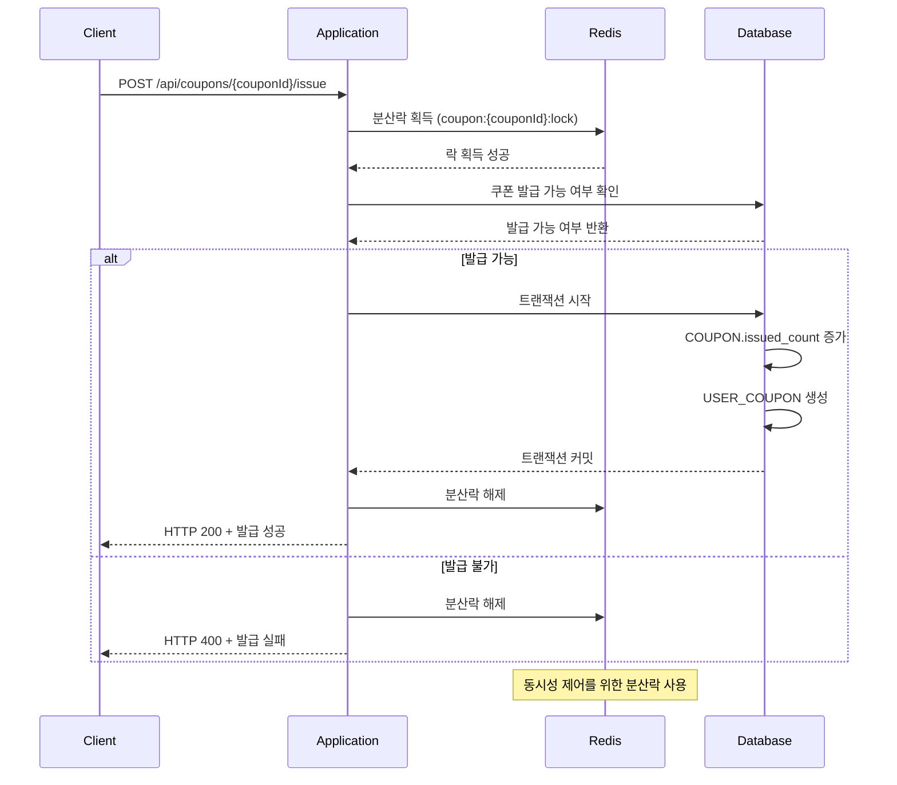

## 4️⃣ 주문/결제 API

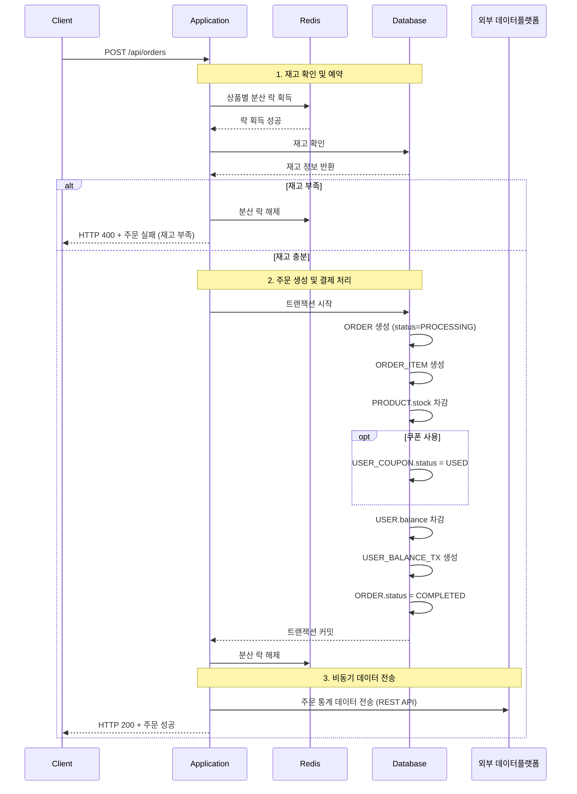

## 5️⃣ 인기 상품 조회 API

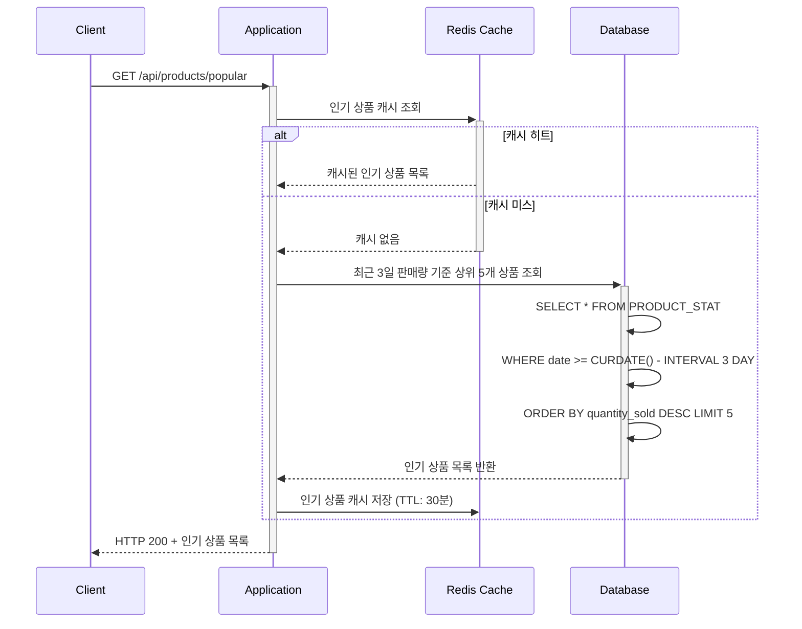

## 📊 실시간 통계 처리

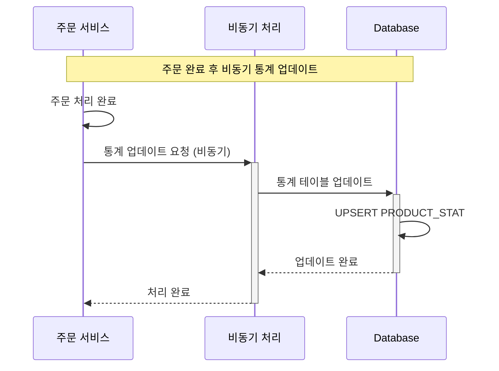

## 📋 추가 API 목록

### 상품 관리 API
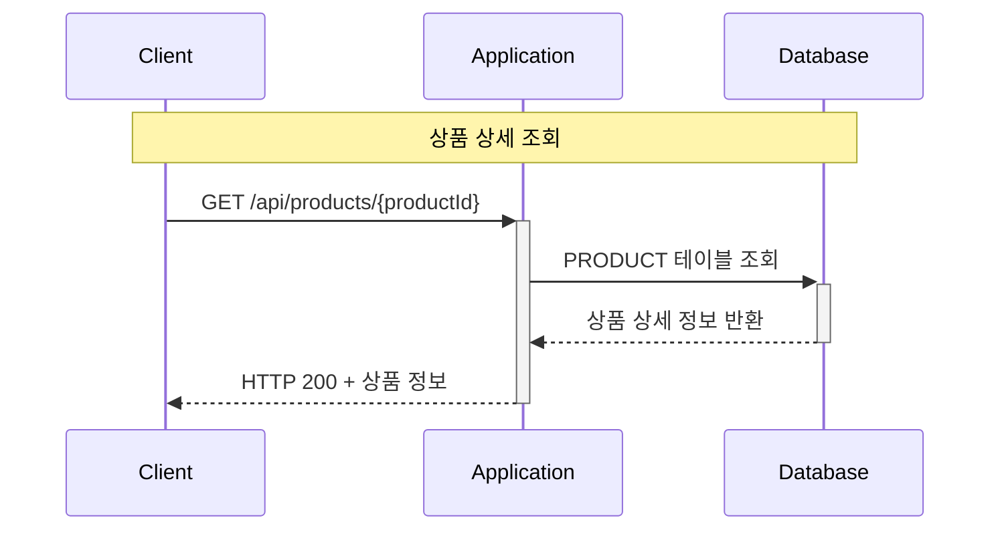

### 주문 내역 조회 API
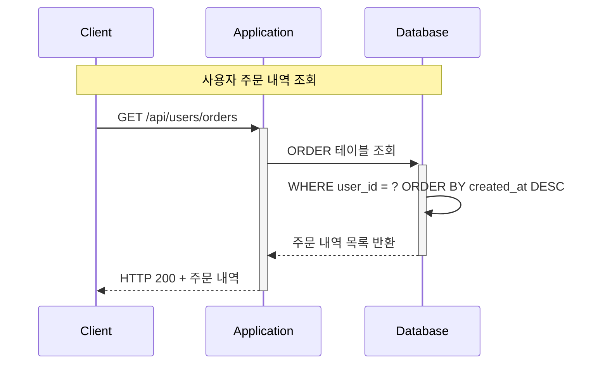

### 잔액 거래 내역 조회 API
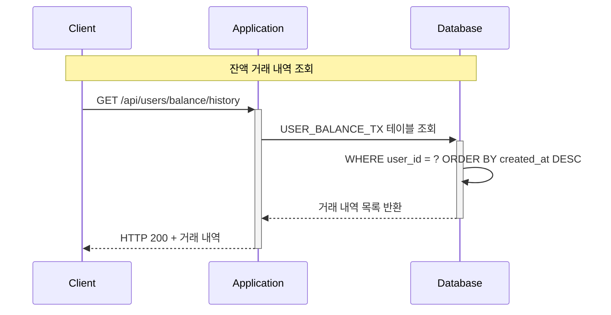
