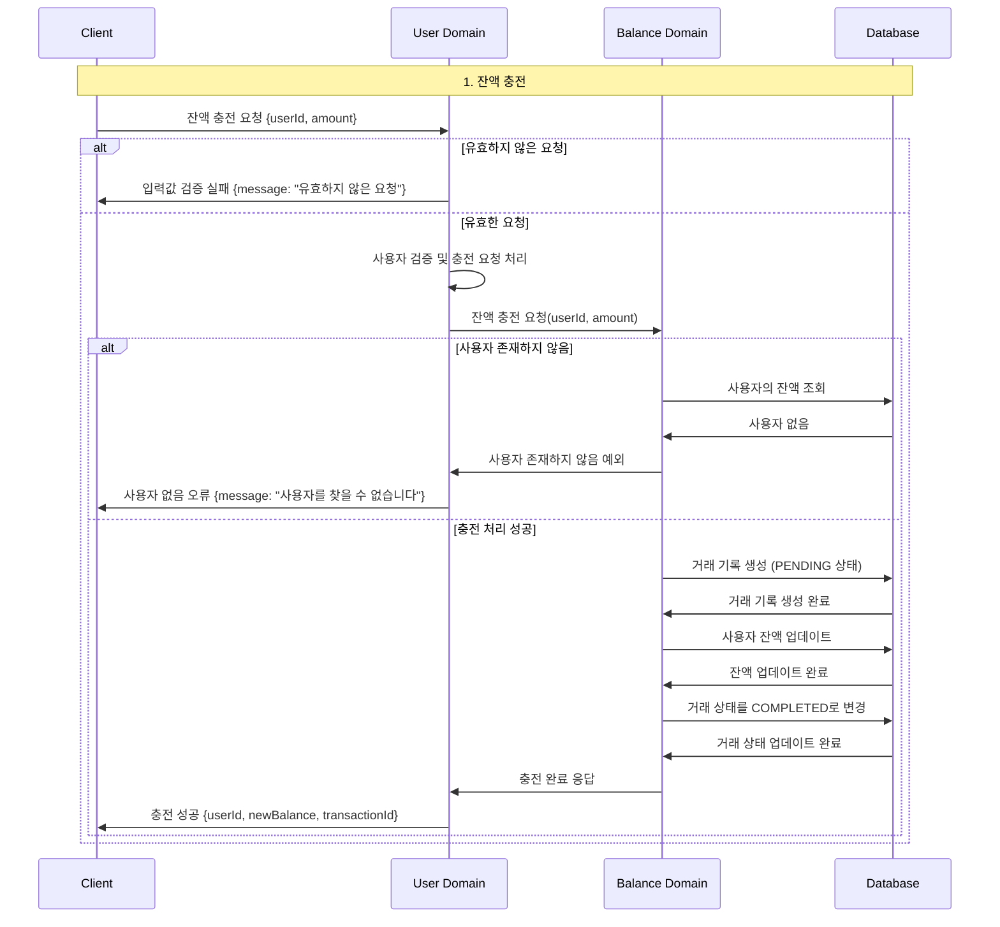
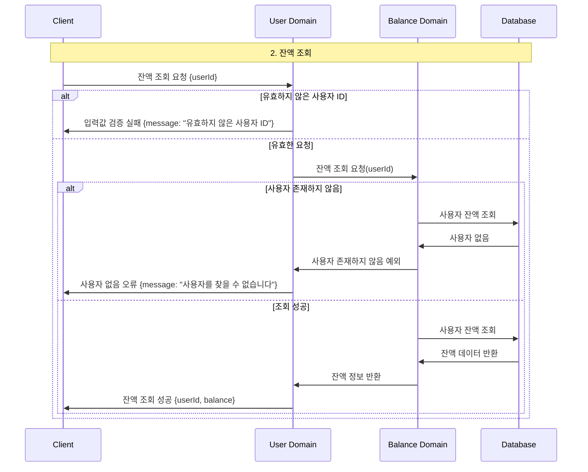
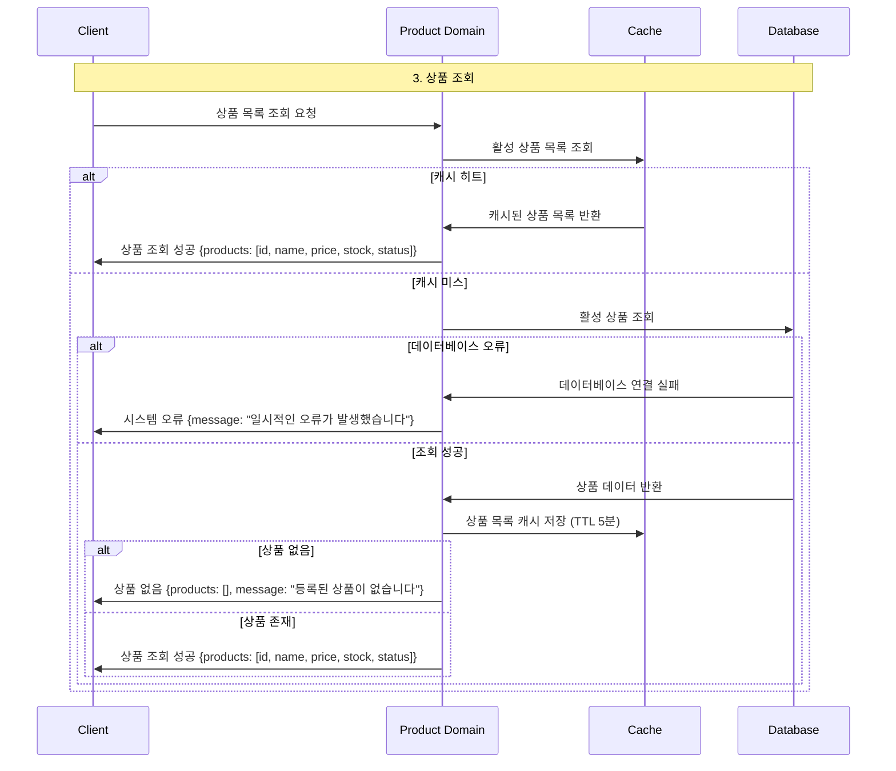
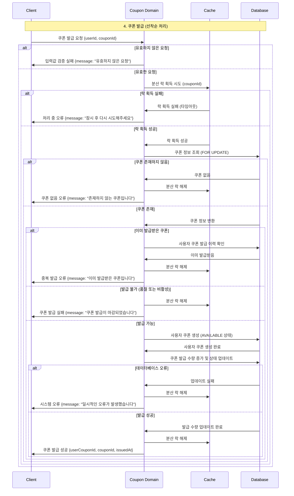
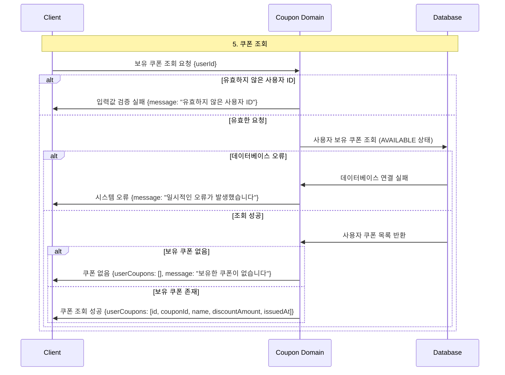
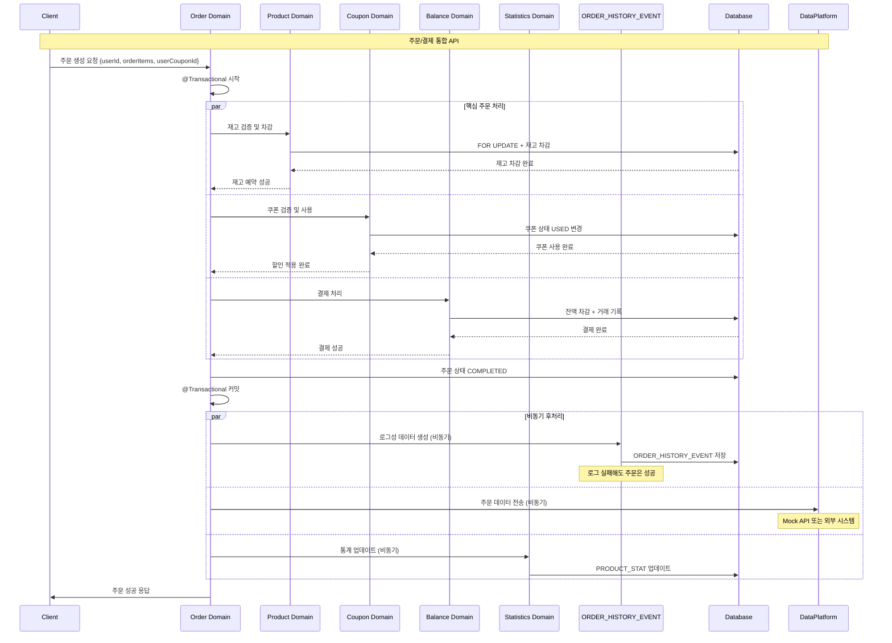
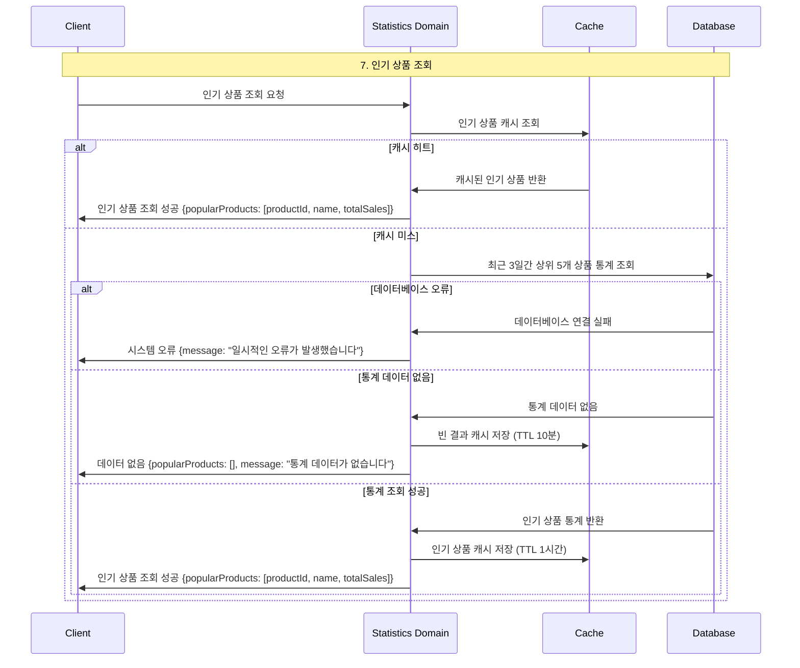

## 잔액 충전

```mermaid
sequenceDiagram
    participant C as Client
    participant User as User Domain
    participant Balance as Balance Domain
    participant DB as Database

        Note over C,DB: 1. 잔액 충전
        C->>User: 잔액 충전 요청 {userId, amount}

        alt 유효하지 않은 요청
            User->>C: 입력값 검증 실패 {message: "유효하지 않은 요청"}
        else 유효한 요청
            User->>User: 사용자 검증 및 충전 요청 처리
            User->>Balance: 잔액 충전 요청(userId, amount)

            alt 사용자 존재하지 않음
                Balance->>DB: 사용자의 잔액 조회
                DB->>Balance: 사용자 없음
                Balance->>User: 사용자 존재하지 않음 예외
                User->>C: 사용자 없음 오류 {message: "사용자를 찾을 수 없습니다"}
            else 충전 처리 성공
                Balance->>DB: 거래 기록 생성 (PENDING 상태)
                DB->>Balance: 거래 기록 생성 완료
                Balance->>DB: 사용자 잔액 업데이트
                DB->>Balance: 잔액 업데이트 완료
                Balance->>DB: 거래 상태를 COMPLETED로 변경
                DB->>Balance: 거래 상태 업데이트 완료
                Balance->>User: 충전 완료 응답
                User->>C: 충전 성공 {userId, newBalance, transactionId}
            end
        end

```

---

## 잔액 조회

```mermaid
sequenceDiagram
    participant C as Client
    participant User as User Domain
    participant Balance as Balance Domain
    participant DB as Database

        Note over C,DB: 2. 잔액 조회
        C->>User: 잔액 조회 요청 {userId}

        alt 유효하지 않은 사용자 ID
            User->>C: 입력값 검증 실패 {message: "유효하지 않은 사용자 ID"}
        else 유효한 요청
            User->>Balance: 잔액 조회 요청(userId)

            alt 사용자 존재하지 않음
                Balance->>DB: 사용자 잔액 조회
                DB->>Balance: 사용자 없음
                Balance->>User: 사용자 존재하지 않음 예외
                User->>C: 사용자 없음 오류 {message: "사용자를 찾을 수 없습니다"}
            else 조회 성공
                Balance->>DB: 사용자 잔액 조회
                DB->>Balance: 잔액 데이터 반환
                Balance->>User: 잔액 정보 반환
                User->>C: 잔액 조회 성공 {userId, balance}
            end
        end
```

---

## 상품 조회

```mermaid
sequenceDiagram
    participant C as Client
    participant Product as Product Domain
    participant Cache as Cache
    participant DB as Database

        Note over C,DB: 3. 상품 조회
        C->>Product: 상품 목록 조회 요청

        Product->>Cache: 활성 상품 목록 조회
        alt 캐시 히트
            Cache->>Product: 캐시된 상품 목록 반환
            Product->>C: 상품 조회 성공 {products: [id, name, price, stock, status]}
        else 캐시 미스
            Product->>DB: 활성 상품 조회

            alt 데이터베이스 오류
                DB->>Product: 데이터베이스 연결 실패
                Product->>C: 시스템 오류 {message: "일시적인 오류가 발생했습니다"}
            else 조회 성공
                DB->>Product: 상품 데이터 반환
                Product->>Cache: 상품 목록 캐시 저장 (TTL 5분)

                alt 상품 없음
                    Product->>C: 상품 없음 {products: [], message: "등록된 상품이 없습니다"}
                else 상품 존재
                    Product->>C: 상품 조회 성공 {products: [id, name, price, stock, status]}
                end
            end
        end
```

---

## 선착순 쿠폰 발급

```mermaid
sequenceDiagram
    participant C as Client
    participant Coupon as Coupon Domain
    participant Cache as Cache
    participant DB as Database

        Note over C,DB: 4. 쿠폰 발급 (선착순 처리)
        C->>Coupon: 쿠폰 발급 요청 {userId, couponId}

        alt 유효하지 않은 요청
            Coupon->>C: 입력값 검증 실패 {message: "유효하지 않은 요청"}
        else 유효한 요청
            Coupon->>Cache: 분산 락 획득 시도 (couponId)

            alt 락 획득 실패
                Cache->>Coupon: 락 획득 실패 (타임아웃)
                Coupon->>C: 처리 중 오류 {message: "잠시 후 다시 시도해주세요"}
            else 락 획득 성공
                Cache->>Coupon: 락 획득 성공
                Coupon->>DB: 쿠폰 정보 조회 (FOR UPDATE)

                alt 쿠폰 존재하지 않음
                    DB->>Coupon: 쿠폰 없음
                    Coupon->>Cache: 분산 락 해제
                    Coupon->>C: 쿠폰 없음 오류 {message: "존재하지 않는 쿠폰입니다"}
                else 쿠폰 존재
                    DB->>Coupon: 쿠폰 정보 반환

                    alt 이미 발급받은 쿠폰
                        Coupon->>DB: 사용자 쿠폰 발급 이력 확인
                        DB->>Coupon: 이미 발급받음
                        Coupon->>Cache: 분산 락 해제
                        Coupon->>C: 중복 발급 오류 {message: "이미 발급받은 쿠폰입니다"}
                    else 발급 불가 (품절 또는 비활성)
                        Coupon->>Cache: 분산 락 해제
                        Coupon->>C: 쿠폰 발급 실패 {message: "쿠폰 발급이 마감되었습니다"}
                    else 발급 가능
                        Coupon->>DB: 사용자 쿠폰 생성 (AVAILABLE 상태)
                        DB->>Coupon: 사용자 쿠폰 생성 완료
                        Coupon->>DB: 쿠폰 발급 수량 증가 및 상태 업데이트

                        alt 데이터베이스 오류
                            DB->>Coupon: 업데이트 실패
                            Coupon->>Cache: 분산 락 해제
                            Coupon->>C: 시스템 오류 {message: "일시적인 오류가 발생했습니다"}
                        else 발급 성공
                            DB->>Coupon: 발급 수량 업데이트 완료
                            Coupon->>Cache: 분산 락 해제
                            Coupon->>C: 쿠폰 발급 성공 {userCouponId, couponId, issuedAt}
                        end
                    end
                end
            end
        end
```

---

## 쿠폰 조회

```mermaid
sequenceDiagram
    participant C as Client
    participant Coupon as Coupon Domain
    participant DB as Database

        Note over C,DB: 5. 쿠폰 조회
        C->>Coupon: 보유 쿠폰 조회 요청 {userId}

        alt 유효하지 않은 사용자 ID
            Coupon->>C: 입력값 검증 실패 {message: "유효하지 않은 사용자 ID"}
        else 유효한 요청
            Coupon->>DB: 사용자 보유 쿠폰 조회 (AVAILABLE 상태)

            alt 데이터베이스 오류
                DB->>Coupon: 데이터베이스 연결 실패
                Coupon->>C: 시스템 오류 {message: "일시적인 오류가 발생했습니다"}
            else 조회 성공
                DB->>Coupon: 사용자 쿠폰 목록 반환

                alt 보유 쿠폰 없음
                    Coupon->>C: 쿠폰 없음 {userCoupons: [], message: "보유한 쿠폰이 없습니다"}
                else 보유 쿠폰 존재
                    Coupon->>C: 쿠폰 조회 성공 {userCoupons: [id, couponId, name, discountAmount, issuedAt]}
                end
            end
        end
```

---

## 주문/ 결제

```mermaid
sequenceDiagram
    participant C as Client
    participant Order as Order Domain
    participant Product as Product Domain
    participant Coupon as Coupon Domain
    participant Balance as Balance Domain
    participant Statistics as Statistics Domain
    participant Event as ORDER_HISTORY_EVENT
    participant DB as Database
    participant DP as DataPlatform

    Note over C,DP: 주문/결제 통합 API
    C->>Order: 주문 생성 요청 {userId, orderItems, userCouponId}

    Order->>Order: @Transactional 시작

    par 핵심 주문 처리
        Order->>Product: 재고 검증 및 차감
        Product->>DB: FOR UPDATE + 재고 차감
        DB-->>Product: 재고 차감 완료
        Product-->>Order: 재고 예약 성공
    and
        Order->>Coupon: 쿠폰 검증 및 사용
        Coupon->>DB: 쿠폰 상태 USED 변경
        DB-->>Coupon: 쿠폰 사용 완료
        Coupon-->>Order: 할인 적용 완료
    and
        Order->>Balance: 결제 처리
        Balance->>DB: 잔액 차감 + 거래 기록
        DB-->>Balance: 결제 완료
        Balance-->>Order: 결제 성공
    end

    Order->>DB: 주문 상태 COMPLETED

    Order->>Order: @Transactional 커밋

    par 비동기 후처리
        Order->>Event: 로그성 데이터 생성 (비동기)
        Event->>DB: ORDER_HISTORY_EVENT 저장
        Note over Event: 로그 실패해도 주문은 성공
    and
        Order->>DP: 주문 데이터 전송 (비동기)
        Note over DP: Mock API 또는 외부 시스템
    and
        Order->>Statistics: 통계 업데이트 (비동기)
        Statistics->>DB: PRODUCT_STAT 업데이트
    end

    Order->>C: 주문 성공 응답
```

---

## 인기상품 조회

```mermaid
sequenceDiagram
    participant C as Client
    participant Statistics as Statistics Domain
    participant Cache as Cache
    participant DB as Database

        Note over C,DB: 7. 인기 상품 조회
        C->>Statistics: 인기 상품 조회 요청

        Statistics->>Cache: 인기 상품 캐시 조회
        alt 캐시 히트
            Cache->>Statistics: 캐시된 인기 상품 반환
            Statistics->>C: 인기 상품 조회 성공 {popularProducts: [productId, name, totalSales]}
        else 캐시 미스
            Statistics->>DB: 최근 3일간 상위 5개 상품 통계 조회

            alt 데이터베이스 오류
                DB->>Statistics: 데이터베이스 연결 실패
                Statistics->>C: 시스템 오류 {message: "일시적인 오류가 발생했습니다"}
            else 통계 데이터 없음
                DB->>Statistics: 통계 데이터 없음
                Statistics->>Cache: 빈 결과 캐시 저장 (TTL 10분)
                Statistics->>C: 데이터 없음 {popularProducts: [], message: "통계 데이터가 없습니다"}
            else 통계 조회 성공
                DB->>Statistics: 인기 상품 통계 반환
                Statistics->>Cache: 인기 상품 캐시 저장 (TTL 1시간)
                Statistics->>C: 인기 상품 조회 성공 {popularProducts: [productId, name, totalSales]}
            end
        end
```
