# 도메인 기반 상태 다이어그램

## 1️⃣ 주문(Order) 상태 다이어그램


## 2️⃣ 상품(Product) 재고 상태 다이어그램


## 3️⃣ 쿠폰(Coupon) 상태 다이어그램


## 4️⃣ 사용자 쿠폰(UserCoupon) 상태 다이어그램


## 5️⃣ 잔액 거래(UserBalanceTransaction) 상태 다이어그램

```mermaid
stateDiagram-v2
    [*] --> PENDING : 거래 요청 생성

    PENDING --> PROCESSING : 거래 처리 시작

    PROCESSING --> COMPLETED : 거래 성공
    PROCESSING --> FAILED : 거래 실패

    COMPLETED --> [*]
    FAILED --> [*]

    note right of PENDING : 거래 대기 상태, 초기 생성 시점
    note right of PROCESSING : 거래 처리 중, 잔액 업데이트 진행
    note right of COMPLETED : 거래 완료 - DEPOSIT: 잔액 증가, PAYMENT: 잔액 차감
    note right of FAILED : 거래 실패, 잔액 부족 등의 이유
```

## 6️⃣ 주문 프로세스 전체 상태 플로우


## 7️⃣ 쿠폰 발급 프로세스 상태 다이어그램


## 8️⃣ 통계 업데이트 상태 다이어그램


## 9️⃣ 캐시 관리 상태 다이어그램

```mermaid
stateDiagram-v2
    [*] --> CacheEmpty : 캐시 없음

    CacheEmpty --> CacheLoading : 데이터 로딩 시작
    CacheLoading --> CacheHit : 로딩 완료
    CacheLoading --> CacheLoadFailed : 로딩 실패

    CacheHit --> CacheExpired : TTL 만료
    CacheHit --> CacheInvalidated : 수동 무효화

    CacheExpired --> CacheEmpty : 캐시 제거
    CacheInvalidated --> CacheEmpty : 캐시 제거
    CacheLoadFailed --> CacheEmpty : 재시도 대기

    note right of CacheHit : 상품 목록 TTL 5분
    note right of CacheInvalidated : 데이터 변경 시 즉시 무효화
```



## 상태 다이어그램 설명

### 주요 특징

1. **트랜잭션 기반 상태 관리**: 각 도메인의 상태 변경은 데이터베이스 트랜잭션과 연동
2. **동시성 제어**: 분산락과 FOR UPDATE를 통한 안전한 상태 전환
3. **실패 처리**: 모든 상태에서 실패 시나리오와 롤백 메커니즘 포함
4. **비동기 처리**: 통계 업데이트와 외부 시스템 연동은 별도 상태로 관리

### 핵심 상태 전환 패턴

- **주문**: PENDING → VALIDATING → PROCESSING → COMPLETED/CANCELLED
- **재고**: ACTIVE ↔ OUT_OF_STOCK ↔ INACTIVE
- **쿠폰**: ACTIVE → SOLD_OUT/EXPIRED
- **사용자쿠폰**: AVAILABLE → USED/EXPIRED (복구 가능)
- **거래**: PENDING → PROCESSING → COMPLETED/FAILED

### 동시성 제어 요소

- **분산락**: 쿠폰 발급 시 Redis 락 사용
- **DB 락**: 재고 차감과 잔액 처리 시 FOR UPDATE 사용
- **원자적 연산**: 모든 상태 변경은 트랜잭션 내에서 처리
