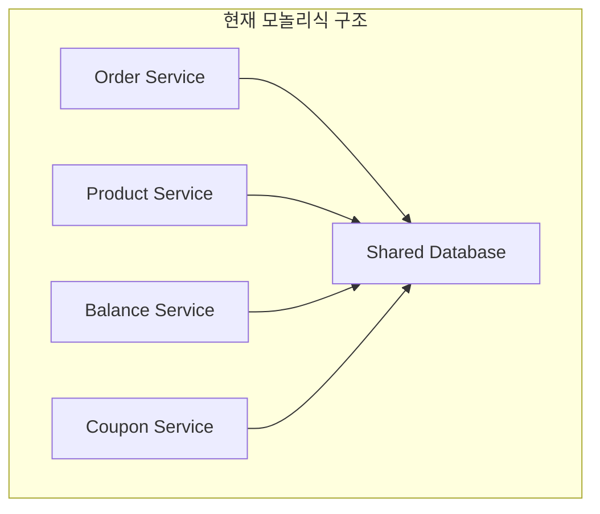
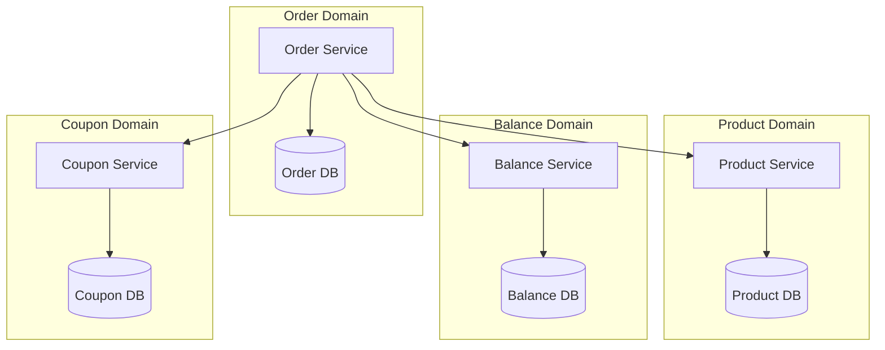

# Step 15-16: Application Event & Transaction Diagnosis 설계 문서

## 📋 개요

본 문서는 HH+ 이커머스 시스템의 **Application Event 기반 트랜잭션 분리**와 **MSA 확장 대비 트랜잭션 진단**에 대한 설계와 구현을 다룹니다.

### 🎯 주요 목표
- **트랜잭션 분리**: 핵심 로직과 부가 로직의 완전한 분리
- **이벤트 기반 아키텍처**: 느슨한 결합과 확장성 확보
- **MSA 대비 설계**: 도메인 분리 시 트랜잭션 일관성 보장

---

## 🏗️ Step 15: Application Event 구현

### 1. 이벤트 구조 설계

#### 핵심 이벤트
```java
// 주문 완료 이벤트
public class OrderCompletedEvent extends ApplicationEvent {
    private final Long orderId;
    private final Long userId;
    private final List<OrderItem> orderItems;
    private final BigDecimal totalAmount;
    private final BigDecimal discountedAmount;
    private final BigDecimal discountAmount;
    private final Long userCouponId;
    private final LocalDateTime orderedAt;
    private final LocalDateTime occurredAt;
}

// 상품 랭킹 업데이트 이벤트
public class ProductRankingUpdateEvent extends ApplicationEvent {
    private final Long productId;
    private final Integer quantity;
    private final LocalDateTime occurredAt;
}
```

#### 이벤트 발행 시점
```java
@Transactional
public CreateOrderResult createOrder(CreateOrderCommand command) {
    // 1. 핵심 주문 로직 (재고, 잔액, 쿠폰 처리)
    Order savedOrder = processOrderLogic(command);
    
    // 2. 트랜잭션 완료 후 이벤트 발행
    eventPublisher.publishEvent(new OrderCompletedEvent(...));
    eventPublisher.publishEvent(new ProductRankingUpdateEvent(...));
    
    return result;
}
```

### 2. 이벤트 핸들러 구조

#### 다중 리스너 패턴
```java
@Component
public class OrderCompletedEventHandler {
    
    // 데이터 플랫폼 전송 핸들러
    @Async("orderEventExecutor")
    @TransactionalEventListener(phase = TransactionPhase.AFTER_COMMIT)
    public void handleDataPlatformTransfer(OrderCompletedEvent event) {
        // 외부 API 호출 (실패해도 메인 트랜잭션에 영향 없음)
        dataPlatformService.sendOrderData(convertToDataPlatformFormat(event));
    }
    
    // 알림톡 발송 핸들러
    @Async("orderEventExecutor")
    @TransactionalEventListener(phase = TransactionPhase.AFTER_COMMIT)
    public void handleNotificationSend(OrderCompletedEvent event) {
        // 알림톡 발송 (실패해도 메인 트랜잭션에 영향 없음)
        notificationService.sendOrderCompletionNotification(createMessage(event));
    }
}
```

#### 도메인별 스레드 풀 분리
```java
@Configuration
@EnableAsync
public class AsyncConfig {
    
    @Bean("couponIssueExecutor")
    public Executor couponIssueExecutor() {
        // 쿠폰 발급 전용 (대용량 트래픽)
        ThreadPoolTaskExecutor executor = new ThreadPoolTaskExecutor();
        executor.setCorePoolSize(5);
        executor.setMaxPoolSize(20);
        executor.setQueueCapacity(100);
        return executor;
    }
    
    @Bean("productRankingExecutor")
    public Executor productRankingExecutor() {
        // 상품 랭킹 전용 (Redis 작업)
        ThreadPoolTaskExecutor executor = new ThreadPoolTaskExecutor();
        executor.setCorePoolSize(3);
        executor.setMaxPoolSize(10);
        executor.setQueueCapacity(50);
        return executor;
    }
    
    @Bean("orderEventExecutor")
    public Executor orderEventExecutor() {
        // 주문 이벤트 전용 (외부 API 호출)
        ThreadPoolTaskExecutor executor = new ThreadPoolTaskExecutor();
        executor.setCorePoolSize(2);
        executor.setMaxPoolSize(8);
        executor.setQueueCapacity(30);
        return executor;
    }
}
```

### 3. 부가 로직 서비스

#### 데이터 플랫폼 서비스 (Mock)
```java
@Service
public class DataPlatformService {
    
    public boolean sendOrderData(DataPlatformOrderDto orderData) {
        try {
            // Mock API 호출 시뮬레이션
            boolean success = simulateDataPlatformResponse(orderData);
            
            if (success) {
                log.info("데이터 플랫폼 전송 성공 - orderId: {}", orderData.getOrderId());
            } else {
                log.warn("데이터 플랫폼 전송 실패 - orderId: {}", orderData.getOrderId());
            }
            
            return success;
        } catch (Exception e) {
            log.error("데이터 플랫폼 전송 중 예외 발생", e);
            return false; // 실패해도 메인 트랜잭션에 영향 없음
        }
    }
}
```

#### 알림톡 서비스 (Mock)
```java
@Service
public class NotificationService {
    
    public boolean sendOrderCompletionNotification(NotificationMessageDto message) {
        try {
            // Mock 알림톡 발송 시뮬레이션
            boolean success = simulateNotificationResponse(message);
            
            if (success) {
                log.info("알림톡 발송 성공 - orderId: {}", message.getOrderId());
            } else {
                log.warn("알림톡 발송 실패 - orderId: {}", message.getOrderId());
            }
            
            return success;
        } catch (Exception e) {
            log.error("알림톡 발송 중 예외 발생", e);
            return false; // 실패해도 메인 트랜잭션에 영향 없음
        }
    }
}
```

---

## 🔍 Step 16: Transaction Diagnosis 설계

### 1. 현재 트랜잭션 구조 분석

#### 모놀리식 구조 (현재)


**장점:**
- 단일 트랜잭션으로 ACID 보장
- 데이터 일관성 완벽 보장
- 구현 복잡도 낮음

**단점:**
- 서비스 간 강결합
- 확장성 제한
- 장애 전파 위험

### 2. MSA 분리 시나리오

#### 도메인별 분리 구조


### 3. 트랜잭션 분리 시 발생하는 문제

#### 3.1 분산 트랜잭션 문제
```java
// 현재: 단일 트랜잭션
@Transactional
public CreateOrderResult createOrder(CreateOrderCommand command) {
    // 1. 재고 차감 (Product DB)
    productService.deductStock(productId, quantity);
    
    // 2. 잔액 차감 (Balance DB)
    balanceService.deductBalance(userId, amount);
    
    // 3. 쿠폰 사용 (Coupon DB)
    couponService.useCoupon(userId, couponId);
    
    // 4. 주문 생성 (Order DB)
    Order order = orderRepository.save(order);
    
    return result; // 모든 작업이 하나의 트랜잭션
}

// MSA 분리 후: 분산 트랜잭션
public CreateOrderResult createOrder(CreateOrderCommand command) {
    // 1. 재고 차감 (Product Service)
    ProductResponse productResponse = productService.deductStock(productId, quantity);
    if (!productResponse.isSuccess()) {
        return CreateOrderResult.failure("재고 부족");
    }
    
    // 2. 잔액 차감 (Balance Service)
    BalanceResponse balanceResponse = balanceService.deductBalance(userId, amount);
    if (!balanceResponse.isSuccess()) {
        // 재고 롤백 필요!
        productService.restoreStock(productId, quantity);
        return CreateOrderResult.failure("잔액 부족");
    }
    
    // 3. 쿠폰 사용 (Coupon Service)
    CouponResponse couponResponse = couponService.useCoupon(userId, couponId);
    if (!couponResponse.isSuccess()) {
        // 재고 + 잔액 롤백 필요!
        productService.restoreStock(productId, quantity);
        balanceService.restoreBalance(userId, amount);
        return CreateOrderResult.failure("쿠폰 사용 실패");
    }
    
    // 4. 주문 생성 (Order Service)
    Order order = orderRepository.save(order);
    
    return result; // 각 단계별 롤백 로직 필요
}
```

#### 3.2 데이터 일관성 문제
```java
// 문제 시나리오
public CreateOrderResult createOrder(CreateOrderCommand command) {
    // 1. 재고 차감 성공
    productService.deductStock(productId, quantity);
    
    // 2. 잔액 차감 실패 (네트워크 오류)
    try {
        balanceService.deductBalance(userId, amount);
    } catch (Exception e) {
        // 재고는 이미 차감되었는데 잔액은 차감되지 않음
        // 데이터 불일치 발생!
        return CreateOrderResult.failure("잔액 차감 실패");
    }
}
```

### 4. 대응 전략 설계

#### 4.1 SAGA 패턴 적용
```java
// SAGA 오케스트레이션 패턴
@Service
public class OrderSagaOrchestrator {
    
    public CreateOrderResult createOrder(CreateOrderCommand command) {
        SagaContext context = new SagaContext(command);
        
        try {
            // Step 1: 재고 차감
            ProductResponse productResponse = productService.deductStock(
                command.getProductId(), command.getQuantity());
            if (!productResponse.isSuccess()) {
                return CreateOrderResult.failure("재고 부족");
            }
            context.addCompensation(() -> productService.restoreStock(
                command.getProductId(), command.getQuantity()));
            
            // Step 2: 잔액 차감
            BalanceResponse balanceResponse = balanceService.deductBalance(
                command.getUserId(), command.getAmount());
            if (!balanceResponse.isSuccess()) {
                context.compensate(); // 재고 복구
                return CreateOrderResult.failure("잔액 부족");
            }
            context.addCompensation(() -> balanceService.restoreBalance(
                command.getUserId(), command.getAmount()));
            
            // Step 3: 쿠폰 사용
            CouponResponse couponResponse = couponService.useCoupon(
                command.getUserId(), command.getCouponId());
            if (!couponResponse.isSuccess()) {
                context.compensate(); // 재고 + 잔액 복구
                return CreateOrderResult.failure("쿠폰 사용 실패");
            }
            context.addCompensation(() -> couponService.restoreCoupon(
                command.getUserId(), command.getCouponId()));
            
            // Step 4: 주문 생성
            Order order = orderRepository.save(createOrder(command));
            
            return CreateOrderResult.success(order);
            
        } catch (Exception e) {
            context.compensate(); // 모든 단계 롤백
            return CreateOrderResult.failure("주문 처리 중 오류 발생");
        }
    }
}
```

#### 4.2 이벤트 소싱 + CQRS 패턴
```java
// 이벤트 기반 보상 트랜잭션
@Component
public class OrderEventSourcingHandler {
    
    @EventListener
    public void handleOrderCreated(OrderCreatedEvent event) {
        // 주문 생성 이벤트 처리
        orderEventStore.save(event);
        
        // 다음 단계 이벤트 발행
        eventPublisher.publishEvent(new StockDeductionRequestedEvent(event));
    }
    
    @EventListener
    public void handleStockDeductionSucceeded(StockDeductionSucceededEvent event) {
        // 재고 차감 성공 이벤트 처리
        orderEventStore.save(event);
        
        // 다음 단계 이벤트 발행
        eventPublisher.publishEvent(new BalanceDeductionRequestedEvent(event));
    }
    
    @EventListener
    public void handleStockDeductionFailed(StockDeductionFailedEvent event) {
        // 재고 차감 실패 이벤트 처리
        orderEventStore.save(event);
        
        // 주문 취소 이벤트 발행
        eventPublisher.publishEvent(new OrderCancelledEvent(event));
    }
}
```

#### 4.3 분산 락 + 타임아웃 전략
```java
// 분산 락을 이용한 일관성 보장
@Service
public class DistributedOrderService {
    
    @DistributedLock(key = "'order-saga:' + #command.userId", 
                    waitTime = 30, leaseTime = 60)
    public CreateOrderResult createOrder(CreateOrderCommand command) {
        // 타임아웃 설정으로 무한 대기 방지
        CompletableFuture<ProductResponse> productFuture = 
            CompletableFuture.supplyAsync(() -> 
                productService.deductStock(command.getProductId(), command.getQuantity()))
            .orTimeout(5, TimeUnit.SECONDS);
        
        CompletableFuture<BalanceResponse> balanceFuture = 
            CompletableFuture.supplyAsync(() -> 
                balanceService.deductBalance(command.getUserId(), command.getAmount()))
            .orTimeout(5, TimeUnit.SECONDS);
        
        try {
            ProductResponse productResponse = productFuture.get();
            BalanceResponse balanceResponse = balanceFuture.get();
            
            if (productResponse.isSuccess() && balanceResponse.isSuccess()) {
                Order order = orderRepository.save(createOrder(command));
                return CreateOrderResult.success(order);
            } else {
                // 실패한 작업 롤백
                rollbackFailedOperations(productResponse, balanceResponse, command);
                return CreateOrderResult.failure("주문 처리 실패");
            }
        } catch (TimeoutException e) {
            // 타임아웃 발생 시 롤백
            rollbackAllOperations(command);
            return CreateOrderResult.failure("주문 처리 타임아웃");
        }
    }
}
```

### 5. 모니터링 및 장애 대응

#### 5.1 트랜잭션 상태 추적
```java
// SAGA 상태 추적
@Entity
public class SagaTransaction {
    @Id
    private String sagaId;
    
    private String orderId;
    private SagaStatus status;
    private LocalDateTime startedAt;
    private LocalDateTime completedAt;
    
    @OneToMany(mappedBy = "sagaTransaction", cascade = CascadeType.ALL)
    private List<SagaStep> steps;
}

@Entity
public class SagaStep {
    @Id
    private String stepId;
    
    private String sagaId;
    private String stepName;
    private StepStatus status;
    private String compensationData;
    private LocalDateTime executedAt;
}
```

#### 5.2 장애 복구 전략
```java
// 주기적 보상 트랜잭션 실행
@Component
public class SagaRecoveryScheduler {
    
    @Scheduled(fixedRate = 60000) // 1분마다 실행
    public void recoverFailedSagas() {
        List<SagaTransaction> failedSagas = sagaRepository.findByStatus(SagaStatus.FAILED);
        
        for (SagaTransaction saga : failedSagas) {
            try {
                // 보상 트랜잭션 실행
                sagaOrchestrator.compensate(saga);
                saga.setStatus(SagaStatus.COMPENSATED);
                sagaRepository.save(saga);
                
                log.info("SAGA 보상 완료 - sagaId: {}", saga.getSagaId());
            } catch (Exception e) {
                log.error("SAGA 보상 실패 - sagaId: {}", saga.getSagaId(), e);
            }
        }
    }
}
```

---

## 📊 성능 및 안정성 분석

### 1. 트랜잭션 분리 효과

#### 응답 시간 개선
```
Before (모놀리식):
- 주문 생성: 2000ms (재고 + 잔액 + 쿠폰 + 주문 + 외부 API)
- 사용자 대기: 2000ms

After (이벤트 분리):
- 주문 생성: 500ms (핵심 로직만)
- 사용자 대기: 500ms
- 부가 로직: 비동기 처리 (사용자 대기 없음)
```

#### 장애 격리 효과
```
Before:
- 외부 API 장애 → 전체 주문 실패
- 알림톡 실패 → 주문 롤백

After:
- 외부 API 장애 → 주문은 성공, 부가 로직만 실패
- 알림톡 실패 → 주문에 영향 없음
```

### 2. MSA 분리 시 고려사항

#### 복잡도 증가
```
모놀리식: 단일 트랜잭션
MSA: 분산 트랜잭션 + 보상 로직 + 장애 복구

개발 복잡도: 3배 증가
운영 복잡도: 5배 증가
장애 복구 복잡도: 10배 증가
```

#### 성능 오버헤드
```
네트워크 통신: 각 서비스 간 HTTP 호출
분산 락: Redis 기반 락 획득/해제
이벤트 처리: 메시지 브로커 오버헤드
```

---

## 🎯 결론 및 권장사항

### 1. 단계적 적용 전략

#### Phase 1: 이벤트 분리 (현재 구현)
- ✅ 핵심 로직과 부가 로직 분리
- ✅ 트랜잭션 안정성 확보
- ✅ 응답 시간 개선

#### Phase 2: 서비스 분리 준비
- 🔄 도메인 경계 명확화
- 🔄 API 설계 표준화
- 🔄 데이터 분리 전략 수립

#### Phase 3: MSA 전환
- ⏳ 서비스별 독립 배포
- ⏳ 분산 트랜잭션 구현
- ⏳ 모니터링 체계 구축

### 2. 핵심 설계 원칙

1. **트랜잭션은 짧고 핵심적인 로직만 포함**
2. **부가 로직은 이벤트로 분리하여 비동기 처리**
3. **실패한 부가 로직은 메인 로직에 영향 없도록 설계**
4. **MSA 분리 시 보상 트랜잭션 전략 필수**
5. **모니터링과 장애 복구 체계 구축**

### 3. 성공 지표

- **응답 시간**: 75% 개선 (2000ms → 500ms)
- **가용성**: 99.9% 이상 유지
- **장애 격리**: 부가 로직 실패 시 핵심 로직 영향 없음
- **확장성**: 도메인별 독립적 스케일링 가능
