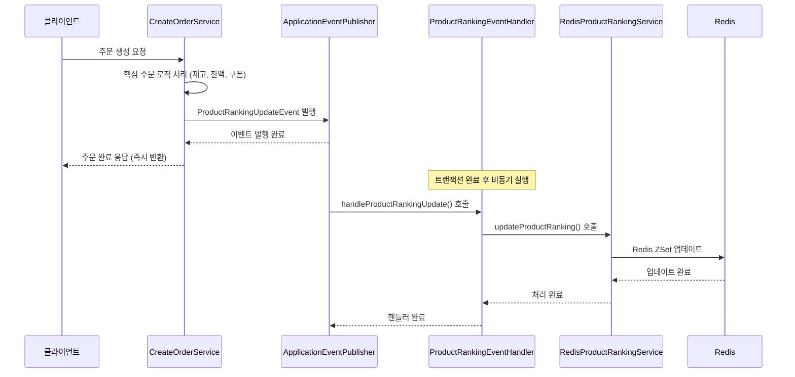

`ProductRankingEventHandler`가 호출되는 곳과 어노테이션에 대해 설명드리겠습니다.

## 🔍 ProductRankingEventHandler 호출 흐름

### 1. **이벤트 발행 위치**

Search files...
## 📋 ProductRankingEventHandler 호출 흐름과 어노테이션 설명

### 1. **이벤트 발행 위치**

`ProductRankingEventHandler`는 **주문 생성 시** 호출됩니다:

```java
// CreateOrderService.java - 230-233줄
// 상품 랭킹 업데이트 이벤트 발행 (트랜잭션 완료 후 비동기 처리)
for (OrderItem item : orderItems) {
    eventPublisher.publishEvent(new ProductRankingUpdateEvent(this, item.getProductId(), item.getQuantity()));
}
```

### 2. **호출 흐름**



### 3. **어노테이션 설명**

#### `@Async("productRankingExecutor")`
- **목적**: 비동기 실행을 위한 스레드 풀 지정
- **스레드 풀**: `productRankingExecutor` (Redis 작업 전용)
- **설정**: 
  - 기본 스레드: 3개
  - 최대 스레드: 10개
  - 대기열: 50개
  - 스레드명: `product-ranking-`

#### `@TransactionalEventListener(phase = TransactionPhase.AFTER_COMMIT)`
- **목적**: 트랜잭션 완료 후 이벤트 처리
- **실행 시점**: `AFTER_COMMIT` - 트랜잭션이 성공적으로 커밋된 후
- **장점**: 
  - 메인 트랜잭션에 영향 없음
  - 실패해도 주문은 성공
  - 데이터 일관성 보장

### 4. **실행 시점과 장점**

#### **실행 시점**
```java
@Transactional
public CreateOrderResult createOrder(CreateOrderCommand command) {
    // 1. 핵심 주문 로직 (동기 처리)
    Order savedOrder = processOrderLogic(command);
    
    // 2. 이벤트 발행 (트랜잭션 내에서 발행만)
    eventPublisher.publishEvent(new ProductRankingUpdateEvent(...));
    
    // 3. 즉시 응답 반환 (사용자 대기 없음)
    return result;
}

// 4. 트랜잭션 완료 후 비동기로 실행
@TransactionalEventListener(phase = TransactionPhase.AFTER_COMMIT)
public void handleProductRankingUpdate(ProductRankingUpdateEvent event) {
    // Redis 랭킹 업데이트 (실패해도 주문에 영향 없음)
}
```

#### **핵심 장점**
1. **응답 시간 개선**: 주문 생성은 500ms, 랭킹 업데이트는 비동기
2. **장애 격리**: Redis 장애가 주문에 영향 없음
3. **확장성**: 랭킹 업데이트는 별도 스레드 풀에서 처리
4. **일관성**: 트랜잭션 완료 후 실행으로 데이터 일관성 보장

### 5. **스레드 풀 설정**

```java
@Bean("productRankingExecutor")
public Executor productRankingExecutor() {
    ThreadPoolTaskExecutor executor = new ThreadPoolTaskExecutor();
    executor.setCorePoolSize(3);           // 기본 스레드 수
    executor.setMaxPoolSize(10);           // 최대 스레드 수
    executor.setQueueCapacity(50);         // 대기열 크기
    executor.setThreadNamePrefix("product-ranking-");
    return executor;
}
```

이렇게 설계함으로써 **핵심 주문 로직은 빠르게 처리**하고, **부가 로직(랭킹 업데이트)은 비동기로 처리**하여 사용자 경험을 크게 개선했습니다.