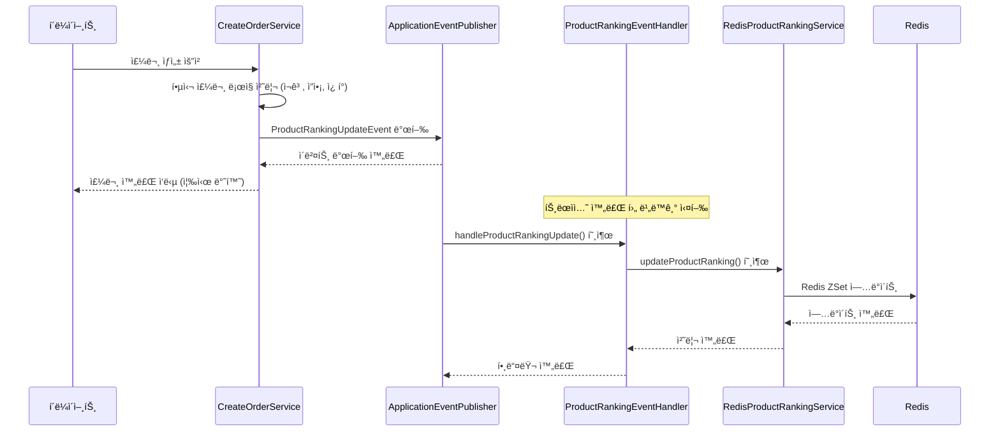

`ProductRankingEventHandler`ê°€ 호출ë˜ëŠ” 곳과 어노테ì´ì…˜ì— 대해 설명드리겠습니다.

## 🔠ProductRankingEventHandler 호출 í름

### 1. **ì´ë²¤íŠ¸ 발행 위치**

Search files...
## 📋 ProductRankingEventHandler 호출 í름과 어노테ì´ì…˜ 설명

### 1. **ì´ë²¤íŠ¸ 발행 위치**

`ProductRankingEventHandler`는 **주문 ìƒì„± ì‹œ** 호출ë©ë‹ˆë‹¤:

```java
// CreateOrderService.java - 230-233줄
// ìƒí’ˆ ë­í‚¹ ì—…ë°ì´íŠ¸ ì´ë²¤íŠ¸ 발행 (트ëœì­ì…˜ 완료 후 비ë™ê¸° 처리)
for (OrderItem item : orderItems) {
    eventPublisher.publishEvent(new ProductRankingUpdateEvent(this, item.getProductId(), item.getQuantity()));
}
```

### 2. **호출 í름**



### 3. **어노테ì´ì…˜ 설명**

#### `@Async("productRankingExecutor")`
- **목ì **: 비ë™ê¸° ì‹¤í–‰ì„ ìœ„í•œ 스레드 í’€ 지정
- **스레드 í’€**: `productRankingExecutor` (Redis ì‘ì—… ì „ìš©)
- **설정**: 
  - 기본 스레드: 3개
  - 최대 스레드: 10개
  - 대기열: 50개
  - 스레드명: `product-ranking-`

#### `@TransactionalEventListener(phase = TransactionPhase.AFTER_COMMIT)`
- **목ì **: 트ëœì­ì…˜ 완료 후 ì´ë²¤íŠ¸ 처리
- **실행 ì‹œì **: `AFTER_COMMIT` - 트ëœì­ì…˜ì´ 성공ì ìœ¼ë¡œ ì»¤ë°‹ëœ í›„
- **ì¥ì **: 
  - ë©”ì¸ íŠ¸ëœì­ì…˜ì— ì˜í–¥ ì—†ìŒ
  - ì‹¤íŒ¨í•´ë„ ì£¼ë¬¸ì€ ì„±ê³µ
  - ë°ì´í„° ì¼ê´€ì„± ë³´ì¥

### 4. **실행 ì‹œì ê³¼ ì¥ì **

#### **실행 ì‹œì **
```java
@Transactional
public CreateOrderResult createOrder(CreateOrderCommand command) {
    // 1. 핵심 주문 ë¡œì§ (ë™ê¸° 처리)
    Order savedOrder = processOrderLogic(command);
    
    // 2. ì´ë²¤íŠ¸ 발행 (트ëœì­ì…˜ ë‚´ì—ì„œ 발행만)
    eventPublisher.publishEvent(new ProductRankingUpdateEvent(...));
    
    // 3. 즉시 ì‘답 반환 (사용ì 대기 ì—†ìŒ)
    return result;
}

// 4. 트ëœì­ì…˜ 완료 후 비ë™ê¸°ë¡œ 실행
@TransactionalEventListener(phase = TransactionPhase.AFTER_COMMIT)
public void handleProductRankingUpdate(ProductRankingUpdateEvent event) {
    // Redis ë­í‚¹ ì—…ë°ì´íŠ¸ (ì‹¤íŒ¨í•´ë„ ì£¼ë¬¸ì— ì˜í–¥ ì—†ìŒ)
}
```

#### **핵심 ì¥ì **
1. **ì‘답 시간 개선**: 주문 ìƒì„±ì€ 500ms, ë­í‚¹ ì—…ë°ì´íŠ¸ëŠ” 비ë™ê¸°
2. **ì¥ì•  격리**: Redis ì¥ì• ê°€ ì£¼ë¬¸ì— ì˜í–¥ ì—†ìŒ
3. **확ì¥ì„±**: ë­í‚¹ ì—…ë°ì´íŠ¸ëŠ” ë³„ë„ ìŠ¤ë ˆë“œ í’€ì—ì„œ 처리
4. **ì¼ê´€ì„±**: 트ëœì­ì…˜ 완료 후 실행으로 ë°ì´í„° ì¼ê´€ì„± ë³´ì¥

### 5. **스레드 풀 설정**

```java
@Bean("productRankingExecutor")
public Executor productRankingExecutor() {
    ThreadPoolTaskExecutor executor = new ThreadPoolTaskExecutor();
    executor.setCorePoolSize(3);           // 기본 스레드 수
    executor.setMaxPoolSize(10);           // 최대 스레드 수
    executor.setQueueCapacity(50);         // 대기열 í¬ê¸°
    executor.setThreadNamePrefix("product-ranking-");
    return executor;
}
```

ì´ë ‡ê²Œ ì„¤ê³„í•¨ìœ¼ë¡œì¨ **핵심 주문 ë¡œì§ì€ 빠르게 처리**하고, **부가 ë¡œì§(ë­í‚¹ ì—…ë°ì´íŠ¸)ì€ ë¹„ë™ê¸°ë¡œ 처리**하여 사용ì ê²½í—˜ì„ í¬ê²Œ 개선했습니다.